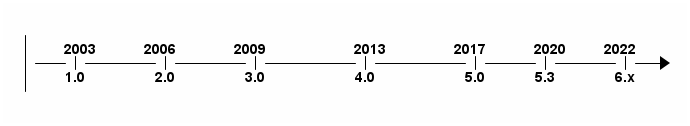

# Лекция 1. Обзор Spring Framework. Системы автоматической сборки

## 🔴 Обзор Spring Framework

### 🟢 Что такое Spring

Spring - легковесный фреймворк(каркас) для построения приложений любого уровня на Java .


Документация - <https://docs.spring.io/spring-framework/reference/overview.html>

С данной формулировкой связны два важных момента.

+ Во-первых, Spring можно применять для построения любого приложения на языке Java (например, автономных, веб-приложений или корпоративных приложений на Java), в отличие от многих других фреймворков (например Apache Struts предназначенного только для создания веб-приложений.)

+ Во-вторых, "легковесный" характер Spring на самом деле обозначает не количество классов или размеры дистрибутива, а главный принцип всей философии Spring - минимальное воздействие.

Сам термин "Spring" означает разные вещи в разных контекстах. Его можно использовать для обозначения самого проекта Spring Framework, с которого все началось. Со временем другие проекты Spring были созданы поверх Spring Framework. Чаще всего, когда люди говорят "Spring", они имеют в виду все семейство проектов.

### 🟢 История Spring и Spring Framework



#### Начало: предшественники и зарождение идеи (2002-2003)

В начале 2000-х для создания сложных корпоративных приложений на Java использовалась технология **J2EE** (позже переименованная в Java EE, а затем в Jakarta EE). В её основе лежал компонентный подход с использованием **Enterprise JavaBeans (EJB)**, однако разработчики столкнулись с рядом проблем:  

+ сложность конфигурации и развертывания,  
+ чрезмерное потребление ресурсов,  
+ жесткая зависимость от сервера приложений.  

##### **2002 год: книга Роджа Джонсона и рождение идеи**  

В 2002 году **Родж Джонсон (Rod Johnson)** опубликовал книгу *"Expert One-on-One J2EE Design and Development"*, в которой предложил альтернативный подход к разработке Java-приложений без использования EJB. Он представил легковесный **IoC-контейнер (Inversion of Control)**, который позволял управлять зависимостями между объектами приложения.  


##### **2003 год: Open-Source и первые шаги Spring**  

Вдохновившись успехом книги, Джонсон опубликовал исходный код IoC-контейнера как open-source проект, назвав его **Spring Framework**. Он предложил новый способ работы с зависимостями с помощью **Dependency Injection (DI)**.  

---

#### Развитие и популяризация (2004-2012)

##### **2004 год: релиз Spring 1.0**  

Spring 1.0 стал первой стабильной версией фреймворка. Основные особенности:  

+ **IoC-контейнер** для управления зависимостями,  
+ **Aspect-Oriented Programming (AOP)** для модульного программирования,  
+ поддержка интеграции с различными ORM-фреймворками (Hibernate, JPA).  

Spring предложил альтернативу тяжелому J2EE и быстро завоевал популярность среди Java-разработчиков.  

##### **2006 год: релиз Spring 2.0**  

Во второй версии добавлены:  

+ **XML-базированная конфигурация**,  
+ расширенные возможности AOP,  
+ поддержка шаблонов JDBC для упрощения работы с базами данных.  

##### **2009 год: релиз Spring 3.0**  

В третьей версии появились:  

+ **аннотации (@Autowired, @Component, @Service, @Repository)**, что уменьшило зависимость от XML,  
+ **поддержка REST**,  
+ **введение JavaConfig** для конфигурации через Java-классы вместо XML.  

Это стало важным шагом к упрощению работы со Spring.  

---

#### **Spring Boot и эра микросервисов (2013 - 2020)**  

##### **2013 год: релиз Spring 4.0**  

Четвертая версия принесла:  

+ поддержку **Java 8**,  
+ совместимость с **Groovy**,  
+ улучшенную работу с WebSockets.  

Однако главным событием стал выпуск **Spring Boot**.  

##### **2014 год: выпуск Spring Boot 1.0**  

Spring Boot кардинально изменил подход к разработке приложений, предложив:  

+ **"конвенцию вместо конфигурации"**,  
+ встроенные сервлет-контейнеры (Tomcat, Jetty, Undertow),  
+ автоматическую настройку (AutoConfiguration).  

Это упростило создание микросервисов и сделало Spring еще популярнее.  

##### **2017 год: релиз Spring 5.0**  

Spring 5.0 представил **Spring WebFlux** — реактивный фреймворк для асинхронного программирования, а также поддержку Java 9 и Kotlin.  

---

#### Современный Spring (2022 - настоящее время)

##### **2022 год: релиз Spring 6.0 и Spring Boot 3.0**  

Основные изменения:  

+ поддержка **Java 17** и **Jakarta EE 9+**,  
+ удаление устаревшего кода,  
+ улучшенная интеграция с GraalVM для нативной компиляции.  

Сегодня Spring остается основным инструментом для разработки Java-приложений, а **Spring Boot, Spring Cloud и WebFlux** активно используются в микросервисной архитектуре.  

### 🟢 Основные пакеты Spring Framework

| **Пакет**                 | **Описание** |
|---------------------------|-------------|
| **org.springframework.context** | Основной пакет Spring IoC-контейнера, поддерживает управление зависимостями и событийную модель. |
| **org.springframework.beans** | Реализация механизма внедрения зависимостей (DI), управление Bean-компонентами. |
| **org.springframework.core** | Базовые утилиты и классы, используемые во всем Spring Framework. |
| **org.springframework.aop** | Поддержка аспектно-ориентированного программирования (AOP) в Spring. |
| **org.springframework.web** | Основной пакет для работы с веб-приложениями (Servlet API, обработка HTTP-запросов). |
| **org.springframework.web.mvc** | Реализация Spring MVC (Model-View-Controller) для построения веб-приложений. |
| **org.springframework.web.reactive** | Реактивное программирование в Spring (Spring WebFlux). |
| **org.springframework.data** | Поддержка работы с базами данных, репозитории, ORM (JPA, Hibernate, MongoDB и др.). |
| **org.springframework.jdbc** | Работа с JDBC (шаблоны, управление транзакциями). |
| **org.springframework.transaction** | Управление транзакциями (программное и декларативное). |
| **org.springframework.orm** | Интеграция с ORM-фреймворками (Hibernate, JPA, MyBatis). |
| **org.springframework.security** | Фреймворк для аутентификации и авторизации пользователей. |
| **org.springframework.boot** | Автоконфигурация Spring Boot, запуск приложений, настройка компонентов. |
| **org.springframework.boot.autoconfigure** | Автоматическая настройка компонентов Spring Boot. |
| **org.springframework.cloud** | Поддержка микросервисов (Spring Cloud, Eureka, OpenFeign, Config Server и др.). |
| **org.springframework.scheduling** | Поддержка асинхронного выполнения задач и планирования (`@Scheduled`). |
| **org.springframework.test** | Инструменты для тестирования Spring-приложений (MockMvc, JUnit, TestContext). |

## 🔴 Системы автоматической сборки

### 🟢 Проблемы ручной сборки приложений**  

Ручная сборка программного обеспечения — это процесс компиляции, настройки, упаковки и развертывания приложения без использования автоматизированных инструментов. Этот подход имеет ряд **существенных недостатков**, особенно в крупных проектах.

#### 1 **Человеческий фактор (ошибки и непоследовательность)**  

+ Разные разработчики могут выполнять сборку **по-разному**, что приводит к несоответствиям.  
+ Ошибки в последовательности шагов (забыли скомпилировать, добавить файлы, выполнить тесты).  
+ Ручной ввод команд может привести к опечаткам.  

#### 2️ **Долгое и неэффективное выполнение**  

+ Выполнение рутинных команд **замедляет процесс разработки**.  
+ Чем больше шагов, тем больше **времени уходит на выпуск новой версии**.  
+ При изменении конфигурации приходится повторять весь процесс заново.  

#### 3️ **Отсутствие стандартизации**  

+ Разные команды могут использовать **разные среды разработки**, что вызывает **конфликты версий**.  
+ В одном окружении приложение работает, а в другом — нет.  

#### 4️ **Сложность управления зависимостями**  

+ Если зависимости загружаются вручную, есть **риск забыть нужные библиотеки** или подключить неправильную версию.  
+ Нет контроля за версиями зависимостей между членами команды.  

#### 5️ **Отсутствие автоматического тестирования**  

+ Без автоматизированных тестов ошибки могут попадать в продакшн.  
+ При каждом изменении приходится запускать тесты **вручную**.  

#### 6️ **Проблемы с CI/CD и DevOps**  

+ Ручная сборка плохо интегрируется с **CI/CD-пайплайнами** (Jenkins, GitHub Actions, GitLab CI).  
+ Автоматизированные развертывания (Docker, Kubernetes) требуют стандартизированных процессов.  

### 🟢 Ant

**Apache Ant** — это инструмент для автоматизации сборки Java-проектов, разработанный Apache Software Foundation. Он был одним из первых инструментов сборки для Java и использовался до появления Maven и Gradle.  


 Документация - <https://ant.apache.org/manual/>

#### **🔹 Основные особенности:**  

+ Основан на **XML-конфигурации** (файл `build.xml`).  
+ Позволяет автоматизировать **компиляцию, тестирование, упаковку (JAR, WAR, EAR)** и развертывание.  
+ Поддерживает **кроссплатформенность**.  
+ Может быть расширен с помощью **кастомных задач** (написанных на Java).  

#### **🔹 Основные понятия:**  

+ **Project** — основной блок сборки.  
+ **Target** — отдельный шаг сборки (например, компиляция, тестирование).  
+ **Task** — конкретное действие (например, `javac`, `jar`, `copy`).  

#### **🔹 Пример `build.xml`:**  

```xml
<project name="MyProject" default="build" basedir=".">
    <target name="clean">
        <delete dir="build"/>
    </target>

    <target name="compile">
        <mkdir dir="build"/>
        <javac srcdir="src" destdir="build"/>
    </target>

    <target name="build" depends="clean,compile">
        <jar destfile="build/myapp.jar" basedir="build"/>
    </target>
</project>
```

#### **🔹 Недостатки:**  

+ XML-конфигурация громоздка.  
+ Нет автоматического управления зависимостями (в отличие от Maven и Gradle).  

### 🟢 Maven


**Apache Maven** — это мощный инструмент для **сборки**, **управления зависимостями** и **жизненным циклом проекта** в Java. Он стандартизирует процесс сборки и упрощает работу с зависимостями.  

Документация - <https://maven.apache.org/guides/index.html>

#### **🔹 Основные возможности maven:**  

+ **Автоматическое управление зависимостями** (через `pom.xml`).  
+ **Структурированный жизненный цикл сборки** (clean, compile, test, package, install, deploy).  
+ **Поддержка плагинов** для тестирования, деплоя и других задач.  
+ **Единый формат структуры проекта (convention over configuration)**.  

---

#### **🔹 Основные файлы и концепции:**  

+ **`pom.xml`** – главный конфигурационный файл проекта.  
+ **Maven Central Repository** – хранилище зависимостей.  
+ **Архетипы (Archetypes)** – шаблоны проектов для быстрого старта.  

---

#### **🔹 Пример `pom.xml`:**  

```xml
<project xmlns="http://maven.apache.org/POM/4.0.0" 
         xmlns:xsi="http://www.w3.org/2001/XMLSchema-instance"
         xsi:schemaLocation="http://maven.apache.org/POM/4.0.0 
         http://maven.apache.org/xsd/maven-4.0.0.xsd">
    <modelVersion>4.0.0</modelVersion>
    <groupId>com.example</groupId>
    <artifactId>myapp</artifactId>
    <version>1.0-SNAPSHOT</version>

    <dependencies>
        <dependency>
            <groupId>org.springframework.boot</groupId>
            <artifactId>spring-boot-starter-web</artifactId>
            <version>3.1.2</version>
        </dependency>
    </dependencies>
</project>
```

---

#### **🔹 Основные команды Maven:**  

| Команда | Описание |
|---------|----------|
| `mvn clean` | Очистка временных файлов проекта. |
| `mvn compile` | Компиляция исходного кода. |
| `mvn test` | Запуск тестов. |
| `mvn package` | Упаковка приложения (JAR/WAR). |
| `mvn install` | Установка артефакта в локальное хранилище. |
| `mvn deploy` | Деплой в удаленное хранилище. |

### 🟢 Gradle


**Gradle** — это современный инструмент для автоматизации сборки, управления зависимостями и развертывания проектов. Он поддерживает **Java**, **Groovy**, **Kotlin**, **Scala** и другие языки программирования, и сочетает в себе лучшие черты **Maven** и **Ant**.

Документация - <https://docs.gradle.org/current/userguide/userguide.html>

#### **🔹 Основные особенности gradle:**

+ **Декларативный стиль конфигурации** с использованием **Groovy** или **Kotlin DSL**.
+ **Гибкость**: позволяет легко настроить сборку под любые нужды, включая кастомные шаги.
+ **Поддержка многоплатформенности**: работает с Java, Android, Kotlin, C/C++ и другими языками.
+ **Управление зависимостями** через **Maven Central**, **JCenter** или локальные репозитории.
+ **Инкрементальная сборка**: Gradle анализирует, какие изменения были сделаны, и собирает только измененные части проекта, что ускоряет сборку.
+ **Поддержка многомодульных проектов** и **параллельных сборок**.

---

#### **🔹 Пример конфигурации (`build.gradle`) для Java-проекта:**

```kotlin
plugins {
    application
}

repositories {
    mavenCentral()
}

dependencies {
    testImplementation(libs.junit.jupiter)
    testRuntimeOnly("org.junit.platform:junit-platform-launcher")

    implementation(libs.guava)
    implementation(libs.spring.context)
    implementation(libs.groovy.all)
}

java {
    toolchain {
        languageVersion = JavaLanguageVersion.of(17)
    }
}


application {
    mainClass = "ru.bsuedu.cap.hello.AppWithSpringJava"

}

tasks.named<Test>("test") {
    useJUnitPlatform()
}

tasks.withType<Jar> {
    manifest {
        attributes["Main-Class"] = "ru.bsuedu.cap.hello.AppWithSpringJava"
    }
}
```

---

#### **🔹 Команды Gradle

+ `gradle build` — собирает проект (компиляция, тесты, упаковка).
+ `gradle clean` — удаляет скомпилированные файлы.
+ `gradle test` — запускает тесты.
+ `gradle run` — запускает приложение (если настроено).

---

#### **🔹 Типы зависимостей в Gradle:**

#### **`implementation`**

+ **Описание**: Это основной тип зависимости, который используется для добавления библиотек, которые необходимы для компиляции и выполнения проекта.
+ **Применение**: Зависимости, которые должны быть доступны для компиляции, но не должны быть переданы в проект, который зависит от вашего (например, библиотека не должна попасть в его classpath).
+ **Пример:**

    ```kotlin
    dependencies {
        implementation('org.springframework.boot:spring-boot-starter-web:2.5.4')
    }

##### **`api`**

+ **Описание**: Зависимости, добавленные через `api`, будут доступны не только в текущем проекте, но и во всех проектах, которые зависят от вашего проекта. Это аналогично зависимости, которая должна быть "публичной".
+ **Применение**: Используется в библиотеках или модулях, где зависимость должна быть доступна для потребителей этой библиотеки.
+ **Пример:**

    ```kotlin
    dependencies {
        api('org.springframework.boot:spring-boot-starter-data-jpa:2.5.4')
    }
    ```

##### **`compileOnly`**

+ **Описание**: Зависимости, указанные как `compileOnly`, нужны только на этапе компиляции, но они не включаются в итоговый артефакт (например, в JAR-файл).
+ **Применение**: Например, при использовании аннотаций или API, которые нужны только для компиляции, но не для выполнения.
+ **Пример:**

    ```kotlin
    dependencies {
        compileOnly('org.projectlombok:lombok:1.18.20')
    }
    ```

##### `runtimeOnly`**

+ **Описание**: Зависимости, которые нужны только на этапе выполнения, но не на этапе компиляции.
+ **Применение**: Используется для библиотек, которые необходимы только во время выполнения приложения (например, драйвера базы данных).
+ **Пример:**

    ```kotlin
    dependencies {
        runtimeOnly('mysql:mysql-connector-java:8.0.25')
    }
    ```

##### **`testImplementation`**

+ **Описание**: Зависимости, используемые только для тестирования.

+ **Применение**: Для библиотек, необходимых только для юнит-тестов, интеграционных тестов и других видов тестирования.
+ **Пример:**

    ```kotlin
    dependencies {
        testImplementation('org.junit.jupiter:junit-jupiter-api:5.7.2')
    }
    ```

##### **`testRuntimeOnly`**

+ **Описание**: Зависимости, которые нужны только во время выполнения тестов, но не для компиляции тестового кода.

+ **Применение**: Например, для зависимостей, которые требуются только в среде тестирования.
+ **Пример:**

    ```kotlin
    dependencies {
        testRuntimeOnly('org.junit.jupiter:junit-jupiter-engine:5.7.2')
    }

---

#### **🔹 Плагины в Gradle:**

В **Gradle** плагины используются для расширении функциональности сборки. Плагины могут быть использованы для различных задач, таких как компиляция, тестирование, создание JAR-ов, деплой и другие. Они могут быть подключены как локально, так и через удаленные репозитории, например, через **Maven Central** или **Gradle Plugin Portal**.

Наиболее популярный способ подключать плагины в **Gradle 5+** — это использовать DSL-блок `plugins {}` в файле `build.gradle`.

**Пример:**

```kotlin
plugins {
    java, // Стандартный плагин для Java-проектов
    application, // Плагин облегчает создание исполняемого приложения JVM.
    `maven-publish`, // Плагин для публикации в Maven
    id("org.springframework.boot") // Плагин для Spring Boot
}
```
