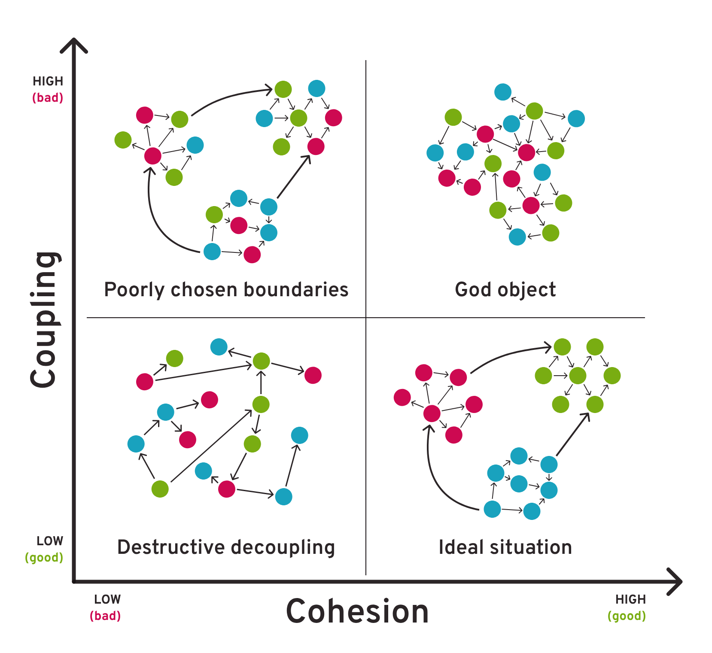

# Лекция 2. Инверсия управления (IoC) и внедрение зависимостей (DI) в Spring

## 🔴 Корпоративный "Hello World"

Разбор примера [Внедрение Spring в "Hello, World"](./demo/hello/) (см. Pro Spring 6, глава 2, Putting a Spring into Hello World)

## 🔴　Сцепление (Coupling) и связность (Cohesion)

Сцепление (Coupling) и связность (Cohesion) — это два важных понятия в программировании, которые помогают оценить качество архитектуры кода.

**Сцепление** — это мера зависимости одного модуля (или класса) от другого. Чем сильнее один модуль зависит от другого, тем выше сцепление.

+ ❌  Жесткое (Tight Coupling) — модули сильно зависят друг от друга, изменения в одном могут сломать другой.
Плохо, потому что усложняет поддержку, тестирование и расширение кода.
+ ✅  Слабое (Loose Coupling) — модули слабо зависят друг от друга и взаимодействуют через интерфейсы или абстракции.
Хорошо, так как код становится гибким и модульным.

**Связность** — это мера того, насколько логически связаны методы и данные внутри одного модуля или класса.

+ ❌  Низкая связность — класс или модуль содержит несвязанные задачи.
Плохо, потому что класс делает слишком многое и сложно поддерживается.
+ ✅  Высокая связность — все методы модуля тесно связаны друг с другом и работают с одними и теми же данными.
Хорошо, так как код становится логичным и предсказуемым.



## 🔴 Принципы инверсии управления

Инверсия управления (Inversion of Control, IoC) — это принцип программирования, при котором управление потоком выполнения программы передаётся извне, а не определяется внутри самого модуля или компонента.

Вместо того чтобы объект сам создавал свои зависимости, эти зависимости передаются ему извне (например, через конструктор, сеттеры или специальный контейнер). Это делает код более гибким, тестируемым и слабо связанным. Объект которому для работы необходимы зависимости называю *зависимым* или *целевым* (target)

Инверсия управления может быть разделена на два подтипа: *поиск зависимостей* (Dependency Lookup) и *внедрение зависимостей* (Dependency Injection).

### 🟢 Извлечение зависимостей (Dependency Pull)

JNDI предоставляет централизованный механизм для хранения и извлечения объектов (EJB). Зависимый объект извлекает из реестра JNDI нужный ему объект по мере необходимости.


```java

import javax.naming.InitialContext;
import javax.naming.NamingException;

public class ClientApp {
    public static void main(String[] args) {
        try {
            InitialContext ctx = new InitialContext();

            // Извлекаем EJB-компонент по имени
            GreetingService service = (GreetingService) ctx.lookup("java:global/MyApp/GreetingService");

            // Используем EJB
            System.out.println(service.greet("Alice"));
        } catch (NamingException e) {
            e.printStackTrace();
        }
    }
}
```

### 🟢 Контекстный поиск зависимостей (Contextualized Dependency Lookup)

Поиск осуществляется в контейнере, некоторым управляющем ресурсом, не только каком-то центральном реестре.


Зависимый объект реализует интерфейс

``` java
public interface ManagedComponent {
    void performLookup(Container container);
}
```

где производиться поиск зависимости в контейнере.

Контейнер предоставляет интерфейс

``` java
public interface Container {
    Object getDependency(String name);
}
```

для поиска объектов.

При запросе объекта из контейнера у запрашиваемого объекта вызывается метод performLookup.

### 🟢 Внедрение зависимостей через конструктор (Constructor Dependency Injection)

Внедрение зависимостей через конструктор происходит в том случае, когда зависимости предоставляются компоненту в его конструкторе(или нескольких конструкторах).С этой целью в компоненте объявляется один или ряд конструкторов,
получающих в качестве аргументов его зависимости, а контейнер инверсии управления передает зависимости компоненту при его получении экземпляра.

```java
class StandardOutMessageRenderer implements MessageRenderer {
    private final MessageProvider messageProvider;
    public StandardOutMessageRenderer(MessageProvider messageProvider) {
        this.messageProvider = messageProvider;
    }
}
```

### 🟢 Внедрение зависимостей через метод установки (Setter Dependency Injection)

При внедрении зависимостей через метод установки контейнер инверсии управления внедряет зависимости компонента через методы установки в стиле компонентов  JavaBeans. Методы установки компонента отражают зависимости, которыми может управлять контейнер инверсии управления.

``` java
public class SetterInjection {
    private Dependency dependency;
    public void setDependency(Dependency dependency) {
        this.dependency = dependency;
    }

    @Override
    public String toString () {
        return dependency.toString();
    }   
}
```

### 🟢 Выбор вида инверсии управления

Предпочтительным методом является -  внедрение зависимостей через конструктор (Constructor Injection).
Его плюсы:

1. Явная зависимость
   + Все зависимости объявляются в конструкторе, что делает код прозрачным и понятным.
   + Легко определить, какие зависимости нужны объекту для работы.

2. Невозможность работы без зависимостей
   + Объект не может быть создан без необходимых зависимостей, так как они передаются в конструктор при создании экземпляра.
   + Исключает возможность появления NullReferenceException из-за того, что зависимости не были установлены.

3. Облегчает тестирование (Unit Testing)
   + Можно легко подставлять моки или стабы при тестировании, передавая их в конструктор.
   + Упрощает использование фреймворков для тестирования, таких как Moq (C#) или Mockito (Java).

4. Уменьшение связанности (Loose Coupling)
   + Класс зависит от абстракций (интерфейсов), а не от конкретных реализаций.
   + Позволяет легко заменять реализации зависимостей, что упрощает поддержку и расширение кода.

5. Облегчает поддержку кода
   + Код становится более читаемым и понятным, так как все зависимости передаются явно.
   + Упрощает рефакторинг, так как зависимости можно заменять без изменений внутренней логики класса.

6. Совместимость с IoC-контейнерами
   + Легко интегрируется с контейнерами внедрения зависимостей (DI-контейнерами) такими как Spring, Dagger.
   + IoC-контейнер может автоматически создавать объекты и управлять их зависимостями.
