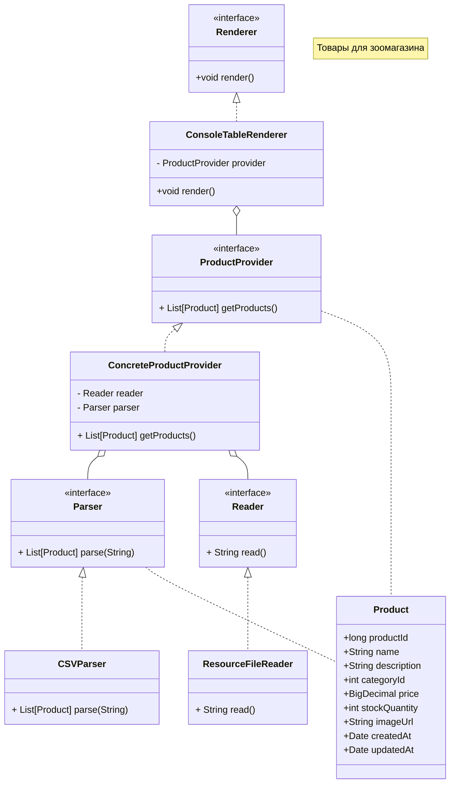

# Лабораторная работа 1. Gradle. Базовое приложение Spring

Мы начинаем серию лабораторных работ по разработке приложений с использование фреймворка Spring.
Все работы будут посвящены одной бизнес модели - "Магазин продажи товаров для животных" 🐈. Шаг за шагом приложение будет усложняться, в нем, на практике, будут использоваться те знания, которые вы почерпнете из лекций и дополнительных материалов.

В данной работе необходимо создать каркас приложения и разобраться с конфигурированием Spring приложений на основе Java-классов. Также вы напишите загрузчик CSV файлов который нам понадобиться в дальнейшем.

Перед началом работы ознакомитесь с [правилами выполнения и сдачи лабораторных работ](../README.md)

## Выполнение работы

1. Скачайте и установите [Axiom Standard JDK 17.0.14](https://axiomjdk.ru/pages/downloads/#/java-17-lts) (предпочтительно) или [Temurin JDK 17.0.14](https://adoptium.net/temurin/releases/?version=17). Используйте [руководство по установке](https://axiomjdk.ru/pages/axiomjdk-install-guide-17.0.14/).
2. Скачайте и установите [Gradle 8.12](https://gradle.org/releases/).  Используйте [руководство по установке](https://gradle.org/install/).
3. С помощью Gradle, в директории [les02/lab](/les02/lab/) создайте проект вид Java Applications, для этого воспользуйтесь руководством [Building Java Applications Sample](https://docs.gradle.org/current/samples/sample_building_java_applications.html).

    Проект должен иметь следующие параметры .
    + java пакет - ru.bsuedu.cad.lab (пакет задается так -  ```gradle init --package ru.bsuedu.cad.lab```, остальное в процессе настройки проекта)
    + Project name - product-table
    + Type - Application
    + Language - Java
    + Java version - 17
    + Structure - Single application project
    + DSL - Kotlin
    + Test framework - JUnit Jupiter

Внимание, при создание проекта согласитесь на перезапись файлов.

4. Добавьте в ваш проект библиотеку [org.springframework:spring-context:6.2.2](https://mvnrepository.com/artifact/org.springframework/spring-context/6.2.2)
5. Реализуйте приложение удовлетворяющее следующим требованиям:
    + Приложение должно представлять собой консольное приложение разработанное с помощью фреймворка Spring и конфигурируемое с помощью Java-конфигурации.
    + Приложение должно читать данные о товарах для магазина из [csv-файла](./assets/product.csv) и выводить его в консоль в виде таблицы (см. рисунок).
  
    

    CSV-файл должен располагаться в директории src/main/resources  вашего приложения.
    
    + Структура приложения должна соответствовать следующей диаграмме классов
  


где,

+ Reader, ResourceFileReader  - класс читающий данные из csv-файла;
+ Parser, CSVParser  - класс парсер CSV файла;
+ ProductProvider, ConcreteProductProvider - класс предоставляющий список товаров;
+ Renderer, ConsoleTableRenderer - класс выводящий список товаров в консоль в виде таблицы;
+ Product - класс описывающий сущность "Товар"

За основу возьмите приложение [из лекции](./demo/hello/app/src/main/java/ru/bsuedu/cap/hello/AppWithSpringJava.java)

6. Приложение должно запускаться с помощью команды ```gradle run```, выводить необходимую информацию в консоль и успешно завершаться.
7. Оформите отчет о выполнении лабораторной работы в виде файла  README.md в директории [les02/lab](/les02/lab/).

## Вопросы для защиты

1. Spring. Определение, назначение, особенности
2. Проблемы ручной сборки приложений
3. Перечислите известные вам вам системы автоматической сборки. Кратно расскажите про каждую из них
4. Типовая структура Java проекта
5. Типы зависимостей в Gradle
6. Что такое принцип инверсии управления. Для чего применяется
7. В чем отличие инверсии управления от внедрения зависимостей
8. Принципы инверсии управления. Перечислите, кратко расскажите про каждый
9. Сцепление (Coupling) и связность (Cohesion)
10. Какой принцип внедрения зависимости желательно использовать и почему
