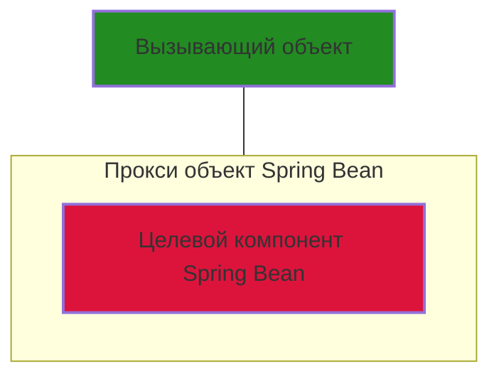

# Лекция 4. Введение в аспектно-ориентированное средствами Spring

Аспектно-ориентированное программирование (AOP, Aspect-Oriented Programming) — это парадигма программирования, которая позволяет отделять сквозную функциональность (cross-cutting concerns) от основной бизнес-логики.

+ Сквозная функциональность — это код, который затрагивает несколько модулей системы (например, логирование, транзакции, обработка ошибок).
+ Без AOP код повторяется в разных классах, что приводит к дублированию и затрудняет поддержку.
+ С AOP такие функции можно вынести в отдельные аспекты, что упрощает код и делает его более читаемым.

AOP в Spring применяется для:

+ **[Логирования (Logging)](https://www.baeldung.com/spring-aspect-oriented-programming-logging)** - позволяет автоматически записывать информацию о выполнении программы (например, вызовы методов, исключения, время выполнения)
+ **[Управления транзакциями (Transaction Management)](https://habr.com/ru/articles/532000/)** - используется в системах с базами данных, чтобы гарантировать целостность данных.
+ **[Обработки исключений (Exception Handling)](https://medium.com/m/global-identity-2?redirectUrl=https%3A%2F%2Ffaun.pub%2Fjava-23-springboot-3-3-4-aop-exception-handling-part-2-e6adc86c8a26)** - глобальная обработка ошибок без дублирования код, перехват исключений и запись их в лог-файл.
+ **Кэширования (Caching)** - улучшает производительность, сохраняя результаты вычислений для повторного использования, например, кэширование результата выполнения метода, чтобы не пересчитывать его заново.
+ **Безопасности (Security)** - обеспечивает контроль доступа к методам и данным, например, проверка аутентификации и авторизации перед выполнением метода.

## 🔴 Основные понятия AOP

Как и в большинстве других технологий, в АОП имеется свой особый ряд понятий
и терминов.

+ **Join Point (точка соединения)** -  определенная точка во время выполнения приложения. Характерными примерами точек соединения служат вызов метода, обращение к методу, инициализация класса и получение экземпляра объекта. Точки соединения относятся к базовым понятиям АОП и определяют места в приложении, где можно вставлять дополнительную логику средствами и dАОП.
  
+ **Advice (совет)** - фрагмент кода, который должен выполняться в определенной точке соединения. Существует много разновидностей советов, например: before (предшествующий совет), когда он выполняется до точки соединения, after (последующий совет), когда он выполняется после точки соединения.
+ **Point cut (срез)** - это совокупность точек соединения, предназначенная для определения момента, когда следует выполнить совет. Создавая срезы, можно приобрести очень точный контроль над тем, как совет применять к компонентам приложения. Как упоминалось ранее, типичной точкой соединения служит вызов метода или же вызовы всех методов из отдельного класса. Зачастую между срезами можно устанавливать сложные отношения, чтобы наложить дополнительное ограничение на момент, å когда следует выполнить совет.
+ **Aspect (аспект)**- это сочетание совета и срезов, инкапсулированных в классе. Такое сочетание приводит в итоге к определению логики, которую следует внедрить в приложение, а также тех мест, где она должна выполняться.
+ **Target (цель)** - это объект, поток исполнения которого изменяется каким-нибудь процессом АОП. Такой  объект часто называют - advised object.
+ **Weaving (связывание)** - это процесс вставки аспекта в определенное место прикладного кода.
+ **Introduction (введение)** -  это процесс, по средствам которого изменяется структура объекта, например водятся новые поля или методы. В АОП введение применяется например для реализации в любом объекте определенного интерфейса, не прибегая к его реализации в классе данного объекта.

## 🔴 Типы АОП

В аспектно-ориентированном программировании (АОП) существуют два основных способа реализации: динамическая (runtime) и статическая (compile-time или load-time).

+ Динамическая реализация (Runtime Weaving)

    Это подход, при котором аспекты применяются во время выполнения программы. Для этого используется прокси-объект (Proxy Pattern), который оборачивает целевой объект и добавляет сквозную функциональность (аспекты). Программа загружается без изменений, а аспекты внедряются во время выполнения.

    Данный подход позволяет достичь большей гибкости, аспекты можно включать или выключать без перекомпиляции кода, аспекты можно применять в зависимости от окружения. Однако за гибкость приходится платить производительностью. 

    Данный подход реализован в библиотеке Spring AOP, которая является частью фреймворка Spring. Динамической связывание работает с использование двух технологий JDK Dynamic Proxy или CGLIB Proxy. JDK Dynamic Proxy применяется для классов которые реализуют какие либо интерфейсы, CGLIB Proxy применяется для классов которые интерфейсы не реализуют.

+ Статическая реализация (Compile-Time или Load-Time Weaving)

    Этот подход предполагает внедрение аспектов во время компиляции или загрузки классов в JVM. Для этого код модифицируется еще до выполнения программы, на этапе компиляции. Применяются инструменты, такие как AspectJ Compiler (ajc), чтобы внедрить аспекты в байт-код. AspectJ также поддерживает подстановку аспектов при загрузке классов (Load-Time Weaving) заменяя стандартный загрузчик классов. 

    Данный подходи позволяет достичь более высокой производительности, так как аспекты уже встроены в код. Однако для любого изменения требуется перекомпиляция кода.

    Данный подход реализован с помощью  AspectJ — аспектно-ориентированное расширение языка Java. Подход также поддерживается фреймворком Spring.

При необходимости реализации в приложении возможностей АОП  на первом этапе предпочтительней выбрать Spring AOP, и заменять его на AspectJ если производительность не устраивает.

## 🔴 Архитектура Spring AOP

Базовая архитектура АОП в Spring основана на прокси (заместителях). Так, если требуется получить экземпляр класса, снабженного советом, то с этой целью придется получить экземпляр заместителя типа ProxyFactory, предоставив прежде всего конструктору класса ProxyFactory все аспекты, которые необходимо привязать к заместителю. Зачастую можно использовать декларативные механизмы конфигурирования АОП, предоставляемые в Spring (класс ProxyFactoryBean, пространство имен аор и аннотации в стиле @AspectJ).

На стадии выполнения каркас Spring анализирует сквозную функциональность, определенную для компонентов Spring Beans в контексте типа ApplicationContext, и динамически формирует замещающие компоненты Spring Beans, которые служат оболочками для целевых компонентов. Вместо непосредственного обращения к целевому
компоненту Spring Bean вызывающие объекты внедряются с помощью замещающего компонента Spring Bean. Затем замещающий компонент Spring Bean анализирует
текущие условия (т.е. точку соединения, срез или совет) и соответственно привязывает подходящий совет.



Spring поддерживает две имплементации прокси:

+ [JDK dynamic proxies](https://www.baeldung.com/java-dynamic-proxies) - используется если целевой объект для которого требуется добавить совет имплементирует интерфейс.
+ [CGLIB proxies](https://www.baeldung.com/cglib) -  используется если целевой объект для которого требуется добавить совет не имплементирует интерфейс, например, конкретный класс.

### 🟢 Advisor (Аспекты)

При реализации АОП в Spring аспект представлен экземпляром класса, реализующего интерфейс Advisor. В каркасе Spring предоставляются удобные реализации интерфейса Advisor, которые можно применять в своих приложениях, не прибегая к необходимости самостоятельно создавать специальные его реализации.

### Proxy классы

Процессом создания Spring Beans управляет класс ProxyFactory, он также отвечает за связывания Spring Beans аспектами.

### Advice (Советы)

Advice (Советы) в Spring AOP являются реализациями интерфейса Advice

| Наименование             | Класс                    | Описание |
|--------------------------|--------------------------------------|--------------------|
| **Before Advice**        | `org.springframework.aop.MethodBeforeAdvice` | Выполняется перед вызовом целевого метода. Используется для логирования, валидации параметров, аутентификации и других предварительных действий. |
| **After Returning Advice** | `org.springframework.aop.AfterReturningAdvice` | Выполняется после успешного завершения метода. Может использоваться для логирования результата или обработки возвращаемого значения. |
| **Throws Advice**        | `org.springframework.aop.ThrowsAdvice` | Вызывается при возникновении исключения в целевом методе. Используется для логирования ошибок и обработки исключений. |
| **Around Advice**        | `org.aopalliance.intercept.MethodInterceptor` | Полностью перехватывает вызов метода, позволяя выполнить код до, после или вместо метода. Используется для кэширования, измерения времени выполнения и управления транзакциями. |

👀 Демонстрация.  Пример ["Нарутофикатор Spring AOP"](./demo/spring-aop)

Пример реализации Around Advice, реализация интерфейса org.springframework.aop.AfterReturningAdvice.

```java
public class NarutoficatorAdvice implements AfterReturningAdvice{

    @Override
    public void afterReturning(Object returnValue, Method method, Object[] args, Object target) throws Throwable {
        System.out.println(", とってばよ！");
    }    
}
```

Для того чтобы использовать полученный Advice, необходимо добавить его к Proxy объекту.

``` java
@Configuration
@ComponentScan(basePackages = "ru.bsuedu.cad.demo")
public class AppConfiguration {
    
 @Bean
 public Person person(){


    var proxy = new ProxyFactory();
    var person = new Person();
    var advice = new NarutoficatorAdvice();
    proxy.addAdvice(advice);
    proxy.setTarget(person);

    return (Person)proxy.getProxy();
 }
}
```

### Pointcut ()

Совет переданный в метод ProxyFactory.addAdvice применяется для всех методов целевого объекта. Иногда такое поведение подходить, например  при логировании, но часто нужно более детально управлять поведением. Для этого используются Point cut (срезы).

Срез представляет собой реализацию  интерфейса Pointcut .

```java
public interface Pointcut {
    ClassFilter getClassFilter ();
    MethodMatcher getMethodMatcher();
}
```
Основные реализации интерфейса Pointcut.

| Класс реализации                             | Описание |
|----------------------------------------------|----------|
| **`org.springframework.aop.support.NameMatchMethodPointcut`** | Сопоставляет методы по имени. Позволяет указывать полное имя метода или использовать шаблоны с `*` (например, `get*`). |
| **`org.springframework.aop.support.JdkRegexpMethodPointcut`** | Использует регулярные выражения для фильтрации методов. Позволяет задавать сложные шаблоны для имен методов. |
| **`org.springframework.aop.support.StaticMethodMatcherPointcut`** | Позволяет определить точку среза (`Pointcut`), которая проверяется только один раз во время загрузки класса (статический анализ). |
| **`org.springframework.aop.support.DynamicMethodMatcherPointcut`** | Выполняет проверку `Pointcut` во время выполнения (динамический анализ). Позволяет применять фильтрацию в зависимости от параметров метода. |
| **`org.springframework.aop.support.AspectJExpressionPointcut`** | Использует выражения **AspectJ** для более гибкого определения точек среза (например, `execution(* com.example.service.*.*(..))`). |
| **`org.springframework.aop.support.ControlFlowPointcut`** | Позволяет применять `Pointcut`, если вызов метода происходит в определенном контексте выполнения (например, если метод вызван из другого метода). |
| **`org.springframework.aop.support.ComposablePointcut`** | Позволяет комбинировать несколько `Pointcut` с помощью логических операций (`AND`, `OR`, `NOT`). |

👀 Демонстрация.  Пример ["Нарутофикатор Spring AOP"](./demo/spring-aop)

Пример реализации NameMatchMethodPointcut

``` java
public class NarutoficatorPointCut  extends NameMatchMethodPointcut{

  @Override 
 public boolean matches(Method method, Class<?> targetClass) {
  return "scream".equals(method.getName());
 }
}

```

### Advisor (Аспект)

Для того использовать Advisor и Pointcut вместе  необходимо объединить их вместе в класс реализующий интерфейс Advisor.  Удобной реализацией такого класса является  DefaultPointcutAdvisor.

Пример создания и использования Advisor.

``` java
@Configuration
@ComponentScan(basePackages = "ru.bsuedu.cad.demo")
public class AppConfiguration {
    
 @Bean
 public Person person(){


    var proxy = new ProxyFactory();
    var person = new Person();
    var advice = new NarutoficatorAdvice();
    var pointcut = new NarutoficatorPointCut();
    var advisor = new DefaultPointcutAdvisor(pointcut, advice);

    proxy.addAdvisor(advisor);
    proxy.setTarget(person);

    return (Person)proxy.getProxy();
 }
}
```

## Конфигурирование с использование Java-конфигурации и ProxyFactoryBean

Использование класса ProxyFactoryBean позволяет выполнить конфигурирование приложения декларативно.
ProxyFactoryBean может сам, используя BeanFactory, получить необходимые ему зависимости.

```java
@Configuration
@ComponentScan(basePackages = "ru.bsuedu.cad.demo")
public class AppConfigurationBean implements BeanFactoryAware {

   private BeanFactory beanFactory;

   @Bean
   public Person person() {
      return new Person();
   }

   @Bean
   public Advisor advisor() {
      var advice = new NarutoficatorAdvice();
      var pointcut = new NarutoficatorPointCut();
      Advisor advisor = new DefaultPointcutAdvisor(pointcut, advice);
      return advisor;
   }

   @Bean
   public Person naruto() {
      var proxy = new ProxyFactoryBean();
      proxy.setInterceptorNames("advisor");
      proxy.setBeanFactory(beanFactory);
      proxy.setTarget(person());
      return (Person) proxy.getObject();
   }

   @Override
   public void setBeanFactory(BeanFactory beanFactory) throws BeansException {
      this.beanFactory = beanFactory;
   }
}
```

## Конфигурирование в стиле AspectJ

AspectJ — это мощный и гибкий фреймворк для аспектно-ориентированного программирования (АОП), который предоставляет расширенные возможности для внедрения аспектов в код. В отличие от Spring AOP, который использует прокси-объекты, AspectJ работает на уровне байт-кода, позволяя более глубоко интегрироваться с приложением.AspectJ умеет работать в режиме Load-Time Weaving.

Spring AOP умет работать с аннотациями AspectJ для внедрения аспектов но для реализации также используются Proxy-объекты. Срезы так же можно задавать с помощью аннотаций.

| Тип `Advice`               | Аннотация AspectJ              | Когда выполняется?                                  | Примечания |
|----------------------------|--------------------------------|-----------------------------------------------------|------------|
| **Before Advice**           | `@Before`                     | Перед вызовом метода                               | Используется для выполнения действий до вызова целевого метода (например, логирование). |
| **After Returning Advice**  | `@AfterReturning`              | После успешного завершения метода                  | Выполняется после успешного выполнения метода и позволяет обработать или изменить результат. |
| **After Throwing Advice**   | `@AfterThrowing`               | При возникновении исключения в методе              | Применяется только в случае исключения, позволяет логировать ошибку или выполнить восстановление состояния. |
| **After Advice**            | `@After`                      | После завершения метода (всегда, независимо от результата) | Выполняется всегда, используется для выполнения завершающих действий, например, освобождения ресурсов. |
| **Around Advice**           | `@Around`                     | До и после выполнения метода (полный контроль)     | Полный контроль над вызовом метода: можно изменить аргументы, результат или полностью заменить выполнение. |

Для того чтобы стало возможно использовать данные аннотации необходимо:

+ Подключить библиотеку org.aspectj:aspectjweaver
+ Для класса конфигурации использовать аннотацию @EnableAspectJAutoProxy


Пример использования.

```java
@Configuration
@ComponentScan(basePackages = "ru.bsuedu.cad.demo")
@EnableAspectJAutoProxy
public class AppConfiguration {

}
```

```java
@Aspect
@Component
public class NarutoficatorAspect {

    @AfterReturning("execution(* ru.bsuedu.cad.demo.Person.*(..))")
    public void　narutoSay() {
        System.out.println("　どってばよ");
    }


    @Around("execution(* ru.bsuedu.cad.demo.Person.*(..))")
    public Object narutoLog(ProceedingJoinPoint joinPoint) throws Throwable {

        System.out.println("Before method execution");

        Object result = joinPoint.proceed();

        System.out.println("After method execution");
        return result;
    
    }
    
}

```

👀 Демонстрация.  Пример ["Нарутофикатор AspectJ"](./demo/aspectj)
