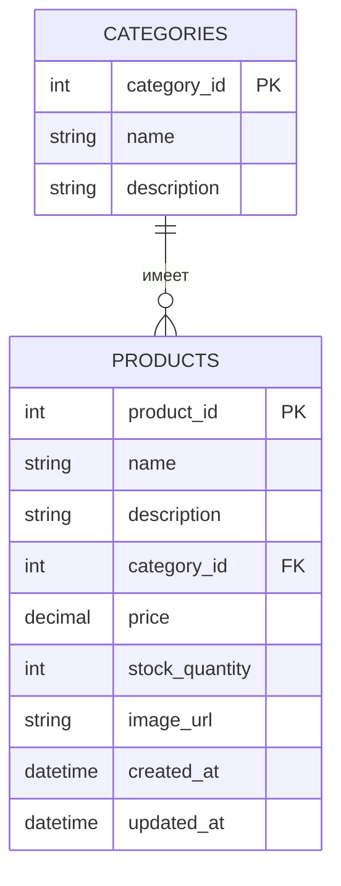

# Лабораторная работа 4. Технологии работы с базами данных.JDBC

Мы продолжаем развивать наше приложение для магазина зоотоваров 🦭.

В этой работе нам необходимо научить наше приложение сохранять данные в базе данных. А также научить наше приложение выполнять SQL запросы и выводить их результаты в логи. В этом нам поможет механизм JDBC (Java Database Connectivity), и такие инструменты Spring как DataSource, JDBCTemplate, RowMapper упрощающие работу с JDBC.

Перед началом работы ознакомитесь с [правилами выполнения и сдачи лабораторных работ](../README.md)

1. Скопируйте результат выполнения лабораторной работы № 2 в директорию [/les06/lab/](/les06/lab/)
2. Подключите к приложению встраиваемую базу данных H2 используя EmbeddedDatabaseBuilder
3. Напишите SQL скрипт создающие две  таблицы "Продукты" (PRODUCTS) и "Категории" (CATEGORIES) (не забудьте про  внешние ключи).



4. Настройте EmbeddedDatabaseBuilder так, чтобы он при старте приложения выполнял данный скрипт и создавал в базе данных таблицы CATEGORIES и PRODUCTS.
5. Для таблицы "Категории" создайте Java класс Category, для моделирования данной сущности (аналогичный классу Product). И класс ConcreteCategoryProvider, аналогичный ConcreteProductProvider, данный класс должен предоставлять данные из CSV файла [category.csv](./assets/category.csv). CSV-файл должен располагаться в директории src/main/resources  вашего приложения
6. Добавьте еще одну имплементацию интерфейса Renderer - DataBaseRenderer которая сохраняет данные считанные из SCV файлов в таблицы базы данных. Реализация DataBaseRenderer должна использоваться пол умолчанию.
7. Реализуйте класс CategoryRequest, данный класс должен выполнять запрос к базе данных получающий следующую информацию - список категорий количество товаров в которых больше единицы. Данная информация должна выводиться в консоль с помощью библиотеки для логирования logback, уровень лога INFO.
8. Приложение должно запускаться с помощью команды ```gradle run```, выводить необходимую информацию в консоль и успешно завершаться.
9. Оформите отчет о выполнении лабораторной работы в виде файла  README.md в директории [les06/lab](/les06/lab/). Отчет должен содержать обновленную  UML-диаграмму классов в формате [mermaid](https://mermaid.js.org/).


## Вопросы для защиты

1. Что такое Spring JDBC и какие преимущества оно предоставляет по сравнению с традиционным JDBC?
2. Какой основной класс в Spring используется для работы с базой данных через JDBC?
3. Какие шаги необходимо выполнить для настройки JDBC в Spring-приложении?
4. Что такое JdbcTemplate и какие основные методы он предоставляет?
5. Как в Spring JDBC выполнить запрос на выборку данных (SELECT) и получить результат в виде объекта?
6. Как использовать RowMapper в JdbcTemplate?
7. Как выполнить вставку (INSERT) данных в базу с использованием JdbcTemplate?
8. Как выполнить обновление (UPDATE) или удаление (DELETE) записей через JdbcTemplate?
9. Как в Spring JDBC обрабатывать исключения, возникающие при работе с базой данных?
10. Какие альтернативные способы работы с базой данных есть в Spring кроме JdbcTemplate?
