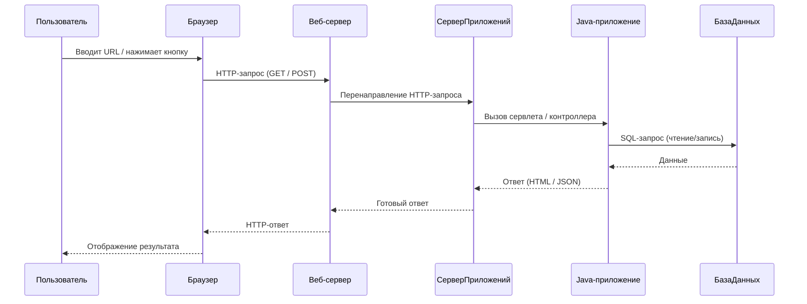
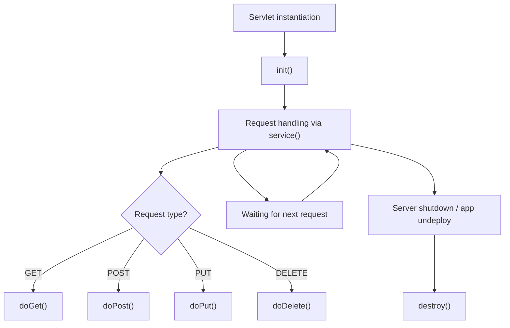

# Сервлеты. Разработка Web-приложений

## Введение в разработку Web-приложений на Java

Web-приложение — клиент-серверное приложение, в котором клиент взаимодействует с веб-сервером при помощи браузера. Логика веб-приложения распределена между сервером и клиентом, хранение данных осуществляется преимущественно на сервере, обмен информацией происходит по сети.

Примеры web-приложений:

+ Интернет-магазины (Wildberries, Ozon)
+ Социальные сети (VK, Facebook)
+ Онлайн-сервисы (Google Docs, Яндекс.Почта)
+ Образовательные платформы (Stepik, Coursera)

Web-приложение



## Java Servlets — Основы разработки веб-приложений на Java

Servlet — это Java-класс, предназначенный для обработки HTTP-запросов и генерации HTTP-ответов. Они лежат в основе традиционного подхода к созданию веб-приложений на Java и являются частью спецификации Java EE (сейчас Jakarta EE).


Пользовательский сервлет наследуется от класса HttpServlet.

HttpServlet — это абстрактный класс из пакета javax.servlet.http, расширяющий класс GenericServlet и предоставляющий реализацию для обработки HTTP-запросов.

| Метод              | Назначение                                                                 |
|--------------------|----------------------------------------------------------------------------|
| `doGet()`          | Обрабатывает HTTP GET-запросы. Обычно используется для получения данных.  |
| `doPost()`         | Обрабатывает HTTP POST-запросы. Используется для отправки/изменения данных.|
| `doPut()`          | Обрабатывает HTTP PUT-запросы. Применяется для обновления ресурса.        |
| `doDelete()`       | Обрабатывает HTTP DELETE-запросы. Применяется для удаления ресурса.       |
| `doHead()`         | Возвращает только заголовки, без тела ответа.                             |
| `doOptions()`      | Показывает, какие методы поддерживает сервер для указанного ресурса.      |
| `doTrace()`        | Используется для диагностики: возвращает полученный запрос в ответе.      |
| `service()`        | Делегирует запрос к соответствующему `doXXX()`-методу. Можно переопределить. |
| `init()`           | Вызывается один раз при инициализации сервлета.                           |
| `destroy()`        | Вызывается перед удалением сервлета из памяти. Очистка ресурсов.          |

По умолчанию метод service() делегирует вызовы соответствующим doXXX() методам на основе типа HTTP-запроса.

Пример обработки GET запроса

``` java

import jakarta.servlet.*;
import jakarta.servlet.http.*;
import java.io.IOException;
import java.io.PrintWriter;

public class MyServlet extends HttpServlet {

    @Override
    protected void doGet(HttpServletRequest req, HttpServletResponse resp)
            throws ServletException, IOException {

        resp.setContentType("text/html");
        PrintWriter out = resp.getWriter();
        out.println("<h1>Hello from HttpServlet!</h1>");
    }
}
```

Пример обработки POST запроса

``` html
<form action="hello" method="post">
    <input type="text" name="username" placeholder="Ваше имя">
    <input type="submit" value="Отправить">
</form>
```

``` java

public class HelloServlet extends HttpServlet {
    @Override
    protected void doPost(HttpServletRequest request, HttpServletResponse response)
            throws ServletException, IOException {

        String username = request.getParameter("username");

        response.setContentType("text/html");
        PrintWriter out = response.getWriter();
        out.println("<h1>Привет, " + username + "!</h1>");
    }
}

```

HttpServletRequest req

Этот объект предоставляет доступ ко всей информации о клиентском запросе:

+ getParameter(String name) — получить параметр формы или URL.
+ getHeader(String name) — получить заголовок запроса.
+ getMethod() — метод HTTP (GET, POST, …).
+ getSession() — объект сессии.
+ getRequestURI() — путь запроса.

HttpServletResponse resp

Этот объект используется для формирования ответа клиенту:

+ setContentType(String type) — установить MIME-тип (например, text/html).
+ getWriter() — получить поток для вывода текста (HTML, JSON…).
+ setStatus(int code) — установить HTTP-код ответа (например, 404, 200).
+ sendRedirect(String location) — сделать редирект на другой URL.

Сервлеты позволяют сохранять данные между запросами с помощью HTTP-сессий:

``` java
    HttpSession session = request.getSession();
    session.setAttribute("user", username);

    String savedName = (String) session.getAttribute("user");
```

Если необходимо полностью контролировать обработку всех типов HTTP-запросов — можешь переопределить service():

``` java
    @Override
    protected void service(HttpServletRequest req, HttpServletResponse res)
            throws ServletException, IOException {
        String method = req.getMethod();
        res.setContentType("text/plain");
        res.getWriter().println("Метод запроса: " + method);
    }
```

Жизненный цикл сервлета



## HTTP-сервер и контейнер сервлетов


Apache Tomcat — это HTTP-сервер и контейнер сервлетов с открытым исходным кодом. Он реализует спецификации Jakarta Servlet, Jakarta Server Pages (JSP), Jakarta Expression Language, и Jakarta WebSocket. Проект развивается Apache Software Foundation и широко используется для развертывания Java-веб-приложений.

Проще говоря, Tomcat — это “движок”, который запускает .war файлы и умеет обрабатывать HTTP-запросы в Java-приложениях.

### Архитектура Tomcat

Основные компоненты Tomcat:

+ Catalina — основной компонент, реализующий Servlet API. Это сам контейнер сервлетов.
+ Coyote — HTTP-коннектор, который слушает порты и обрабатывает HTTP-запросы (например, на 8080).
+ Jasper — JSP-движок, который компилирует JSP в сервлеты.
+ Realm — система аутентификации и авторизации.
+ Server.xml — главный конфигурационный файл.
  
### Установка и запуск

#### Установка Apache Tomcat тривиальна.

1. Проверьте, что у вас утановлена java, выполнив команду ``` java -version``. Если java не найдена выполните ее установку.
2. Скачайте бинарную сборку последней версии (11) <https://tomcat.apache.org/download-11.cgi>
3. Разархивируйте в выбранную директорию
4. Apache Tomcat установлен.

#### Запуска и остановка Apache Tomcat

Запуск

``` bash
./bin/startup.sh     # Linux/macOS
.\bin\startup.bat    # Windows

```

Проверка работоспособности

откройте в браузере страницу <http://localhost:8080>

Остановка

``` bash
./bin/shutdown.sh     # Linux/macOS
.\bin\shutdown.bat    # Windows

```

#### Добавление пользователя-администратора для Tomcat

Для установки приложений через web интерфейс необходимо обладать правами администратора.

Чтобы получить доступ к веб-интерфейсу менеджера и панели администратора Tomcat, необходимо создать пользователя с соответствующими правами.

1. Откройте файл конфигурации `conf/tomcat-users.xml` в каталоге установки Tomcat.

2. Добавьте следующую строку внутрь тега `<tomcat-users>`:

```xml
<role rolename="manager-gui"/>
<role rolename="admin-gui"/>
<user username="admin" password="admin123" roles="manager-gui,admin-gui"/>
```

3. Сохраните файл и перезапустите Tomcat.

Теперь вы можете зайти в интерфейс менеджера по адресу:  
<http://localhost:8080/manager/html>  
и в панель администратора:  
<http://localhost:8080/host-manager/html>

Используйте логин `admin` и пароль `admin123`.

### Web-приложение

Типовая структура проекта

```
my-servlet-app/
├── build.gradle.kts
├── settings.gradle.kts
├── src/
│   └── main/
│       ├── java/
│       │   └── com/example/HelloServlet.java
│       └── webapp/
│           ├── index.jsp
│           └── WEB-INF/
│               └── web.xml

```

Результатом сборки web приложения является war-файл.
WAR — это Web Application Archive.
Это архив-файл (по сути, ZIP), который содержит веб-приложение Java, готовое к деплою на сервлет-контейнер вроде Tomcat, Jetty, WildFly, и т.д.

Для того чтобы собрать war-файл в build.gradle.kt необходимо следующие изменения

``` kotlin

plugins {
    java
    war
}

group = "com.example"
version = "1.0"

repositories {
    mavenCentral()
}

dependencies {
    implementation("org.springframework:spring-web:6.2.4")
    providedCompile("jakarta.servlet:jakarta.servlet-api:6.1.0")
}

java {
    sourceCompatibility = JavaVersion.VERSION_11
    targetCompatibility = JavaVersion.VERSION_11
}

tasks.war {
    archiveFileName.set("my-servlet-app.war")
}

```

Теперь мы можем использовать в приложении сервлеты. Конфигурирование сервлета можно выполнять в помощью аннотаций или с помощью web.xml файла.

``` java
    package com.example;

    import javax.servlet.ServletException;
    import javax.servlet.annotation.WebServlet;
    import javax.servlet.http.*;
    import java.io.IOException;
    import java.io.PrintWriter;

    @WebServlet("/hello")  // работает, если не используешь web.xml для маппинга
    public class HelloServlet extends HttpServlet {
        @Override
        protected void doGet(HttpServletRequest req, HttpServletResponse resp)
                throws ServletException, IOException {
            resp.setContentType("text/html");
            PrintWriter out = resp.getWriter();
            out.println("<html><body>");
            out.println("<h1>Hello from raw Servlet!</h1>");
            out.println("</body></html>");
        }
    }
```
Пример web.xml

``` xml
<web-app xmlns="http://xmlns.jcp.org/xml/ns/javaee"
         version="3.1">

    <servlet>
        <servlet-name>helloServlet</servlet-name>
        <servlet-class>com.example.HelloServlet</servlet-class>
    </servlet>

    <servlet-mapping>
        <servlet-name>helloServlet</servlet-name>
        <url-pattern>/hello</url-pattern>
    </servlet-mapping>

</web-app>

```

Для получения контекста Spring можно использовать метод init.

``` java
package com.example.servlet;

import com.example.config.AppConfig;
import com.example.service.HelloService;
import org.springframework.context.ApplicationContext;
import org.springframework.context.annotation.AnnotationConfigApplicationContext;

import javax.servlet.ServletException;
import javax.servlet.http.*;
import java.io.IOException;
import java.io.PrintWriter;

public class HelloServlet extends HttpServlet {

    private HelloService helloService;

    @Override
    public void init() throws ServletException {
        // Инициализация Spring-контекста вручную
        ApplicationContext context = new AnnotationConfigApplicationContext(AppConfig.class);
        this.helloService = context.getBean(HelloService.class);
    }

    @Override
    protected void doGet(HttpServletRequest req, HttpServletResponse resp)
            throws ServletException, IOException {
        resp.setContentType("text/html");
        PrintWriter out = resp.getWriter();
        out.println("<h1>" + helloService.getMessage() + "</h1>");
    }
}

```

Однако такой не оптимальный.  Лучше получить контейнер одни раз и использовать его для всех сервлетов.
Для этого используется Listener (типа Context Listener)

Listener (слушатель) — это специальный класс, который “слушает”, когда что-то происходит (например, приложение запускается, сессия создаётся, запрос приходит), и реагирует на это.

``` xml
    <context-param>
        <param-name>contextClass</param-name>
        <param-value>org.springframework.web.context.support.AnnotationConfigWebApplicationContext</param-value>
    </context-param>

    <context-param>
        <param-name>contextConfigLocation</param-name>
        <param-value>com.example.config.AppConfig</param-value>
    </context-param>

    <listener>
        <listener-class>org.springframework.web.context.ContextLoaderListener</listener-class>
    </listener>

``` 
Тогда сервлет примет следующий вид.

``` java
package com.example.servlet;

import com.example.service.HelloService;
import org.springframework.web.context.WebApplicationContext;
import org.springframework.web.context.support.WebApplicationContextUtils;

import javax.servlet.*;
import javax.servlet.http.*;
import java.io.IOException;

public class FirstServlet extends HttpServlet {
    private HelloService helloService;

    @Override
    public void init() throws ServletException {
        ServletContext servletContext = getServletContext();
        WebApplicationContext context = WebApplicationContextUtils.getRequiredWebApplicationContext(servletContext);
        this.helloService = context.getBean(HelloService.class);
    }

    @Override
    protected void doGet(HttpServletRequest req, HttpServletResponse resp)
            throws ServletException, IOException {
        resp.getWriter().println("FirstServlet: " + helloService.getMessage());
    }
}
```
