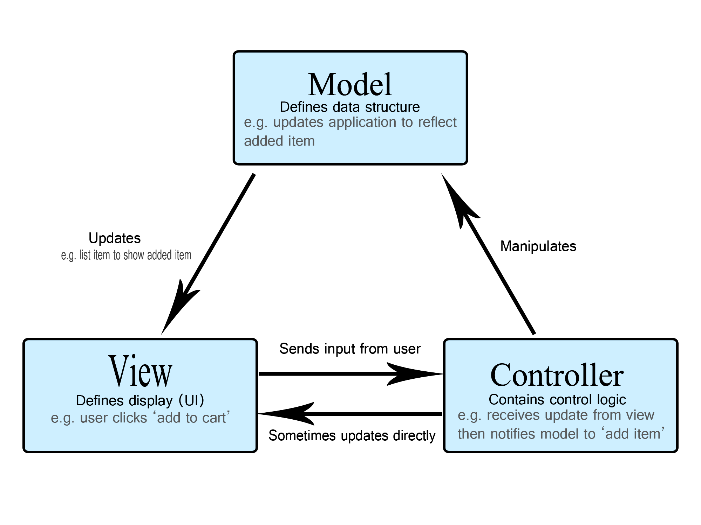

# Spring MVC

Spring MVC (Model–View–Controller) — это веб-фреймворк внутри экосистемы Spring, предназначенный для создания веб-приложений и REST API. Он реализует классический MVC-подход к разделению логики приложения:

+ Model: бизнес-данные и логика
+ View: представление (веб-страницы или JSON-ответы)
+ Controller: связывающее звено между моделью и представлением



Spring MVC — это часть spring-webmvc модуля и может использоваться как с Spring Boot, так и без него, вплоть до минимальной установки с сервлет-контейнером.

## Основные компоненты Spring MVC

1. DispatcherServlet

Главный контроллер, фронт-контроллер всего фреймворка. Он перехватывает все входящие HTTP-запросы и направляет их к нужным компонентам.

2. HandlerMapping

Определяет, какой контроллер и метод должен обработать конкретный HTTP-запрос.

3. Controller

Класс или метод, помеченный аннотациями @Controller или @RestController, отвечающий за обработку запросов.

4. Model / ModelAndView

Контейнеры для передачи данных из контроллера в представление.

5. ViewResolver

Определяет, какое представление (View) нужно отрисовать. Это может быть HTML-шаблон, PDF, XML или просто JSON.

**Жизненный цикл запроса в Spring MVC**

1. Пользователь отправляет HTTP-запрос (например, GET /users/1)
2. DispatcherServlet перехватывает запрос
3. С помощью HandlerMapping определяется, какой контроллер будет вызван
4. Контроллер обрабатывает запрос, используя бизнес-логику и возвращает модель/данные
5. ViewResolver определяет, какое представление нужно использовать (если есть)
6. Ответ возвращается клиенту


## Принципы, лежащие в основе Spring MVC

1. Разделение ответственности

Контроллеры не хранят бизнес-логику, они делегируют её сервисам. Это делает код читаемым и модульным.

2. Инверсия управления и внедрение зависимостей (DI)

Spring автоматически внедряет нужные зависимости (например, сервисы в контроллеры), используя контейнер.

3. Конфигурация через аннотации

Современный Spring MVC минимизирует XML. Вместо этого используется Java-конфигурация и аннотации (@Configuration, @RestController, @GetMapping и др.).

4. Гибкая маршрутизация

Ты можешь задать любую схему маршрутов с параметрами, REST-стилем, методами (GET, POST, PUT, DELETE и т.д.).

5. Расширяемость
Можно подключать свои фильтры, интерцепторы, обработчики ошибок, конвертеры JSON и т.д.

## Настройка поддержки веб-MVC в приложении

### Подключение необходимых библиотек

Добавление в build.gradle.kts необходимых библиотек

``` kotlin

dependencies {
    implementation("org.springframework:spring-webmvc:6.2.2")
    implementation("org.springframework:spring-context:6.2.2")
    implementation("com.fasterxml.jackson.core:jackson-databind:2.17.0")
    providedCompile("jakarta.servlet:jakarta.servlet-api:6.1.0")
}

```

### Активация поддержки веб-MVC

@EnableWebMvc в Spring Framework используется для активации поддержки веб-MVC в вашем приложении. Это аннотация уровня класса, которая обычно применяется к одному из ваших классов конфигурации (классу, помеченному @Configuration).

```java
@Configuration
@ComponentScan(basePackages = "ru.bsuedu.cad.demo")
@EnableJpaRepositories(basePackages = "ru.bsuedu.cad.demo.repository")
@PropertySource("classpath:db/jdbc.properties")
@EnableTransactionManagement
@EnableWebMvc
public class Config {
    private static Logger LOGGER = LoggerFactory.getLogger(Config.class);
    ....
}

```

### DispatcherServlet — центральный механизм

DispatcherServlet — это Front Controller, который перехватывает все входящие запросы.
Конфигурирование DispatcherServlet осуществляется с использование файла web.xml.

```xml
    <servlet>
        <servlet-name>dispatcher</servlet-name>
        <servlet-class>org.springframework.web.servlet.DispatcherServlet</servlet-class>
        <init-param>
            <param-name>contextClass</param-name>
            <param-value>org.springframework.web.context.support.AnnotationConfigWebApplicationContext</param-value>
        </init-param>
        <init-param>
            <param-name>contextConfigLocation</param-name>
            <param-value>ru.bsuedu.cad.demo.Config</param-value>
        </init-param>
        <load-on-startup>1</load-on-startup>
    </servlet>
    <servlet-mapping>
        <servlet-name>dispatcher</servlet-name>
        <url-pattern>/</url-pattern>
    </servlet-mapping>
```

## Контроллеры: @Controller и @RestController

@Controller
Используется, когда вы возвращаете View. Мы не используем его в этой лекции.

@RestController
Аннотация @RestController в Spring Framework представляет собой удобную комбинацию двух других аннотаций: @Controller и @ResponseBody. Она используется для создания RESTful веб-сервисов, где каждый метод контроллера возвращает данные, которые напрямую записываются в тело ответа (например, в формате JSON или XML), а не имя представления для отображения.

Ключевые особенности и назначение @RestController:

1. Комбинация @Controller и @ResponseBody:
    @Controller: Указывает, что класс является контроллером Spring MVC и способен обрабатывать входящие веб-запросы.
    @ResponseBody: Указывает, что возвращаемое значение метода контроллера должно быть напрямую связано с телом веб-ответа. Spring автоматически преобразует возвращаемый объект в нужный формат (обычно JSON, если в classpath присутствует библиотека Jackson, или XML, если есть JAXB).

2. Упрощение разработки REST API: Использование @RestController позволяет разработчикам сосредоточиться на логике обработки запросов и формирования ответов, не беспокоясь о явном добавлении @ResponseBody к каждому методу. Это делает код более лаконичным и читаемым при разработке RESTful API.

3. Автоматическое преобразование данных: Spring использует HttpMessageConverter для автоматического преобразования возвращаемых объектов в тело ответа в зависимости от типа содержимого запроса (Content-Type) и заголовка Accept в запросе клиента. Наиболее распространенным форматом является JSON, для поддержки которого обычно добавляют зависимость spring-boot-starter-web (которая включает Jackson).

``` java 
import org.springframework.web.bind.annotation.GetMapping;
import org.springframework.web.bind.annotation.PathVariable;
import org.springframework.web.bind.annotation.PostMapping;
import org.springframework.web.bind.annotation.RequestBody;
import org.springframework.web.bind.annotation.RestController;

import java.util.HashMap;
import java.util.Map;

@RestController
public class UserController {

    private Map<Integer, String> users = new HashMap<>();
    private int nextId = 1;

    @GetMapping("/users")
    public Map<Integer, String> getAllUsers() {
        return users;
    }

    @GetMapping("/users/{id}")
    public String getUser(@PathVariable int id) {
        return users.get(id);
    }

    @PostMapping("/users")
    public Map<String, Object> createUser(@RequestBody String name) {
        int userId = nextId++;
        users.put(userId, name);
        Map<String, Object> response = new HashMap<>();
        response.put("id", userId);
        response.put("name", name);
        return response;
    }
```

## Маршрутизация и аннотации

@RequestMapping — это фундаментальная аннотация в Spring MVC (Model-View-Controller) и Spring WebFlux, которая используется для сопоставления HTTP-запросов с конкретными методами-обработчиками внутри ваших контроллеров. Представьте это как диспетчер, который направляет входящие веб-запросы к соответствующей части кода вашего приложения, способной их обработать.

Вот основные аспекты и функции @RequestMapping:

Основная функциональность:

Сопоставление URL-адресов: Основная цель — связать определенный URL-путь (или шаблон путей) с методом контроллера. Когда клиент отправляет HTTP-запрос по этому URL-адресу, вызывается метод, аннотированный @RequestMapping.
Обработка HTTP-методов: Вы можете указать, какие HTTP-методы (GET, POST, PUT, DELETE, PATCH) должен обрабатывать метод-обработчик. По умолчанию @RequestMapping соответствует всем HTTP-методам.
Сужение области запросов: Помимо URL-адреса и HTTP-метода, @RequestMapping позволяет дополнительно уточнять сопоставление на основе:

+ params: Параметры запроса (например, ```@RequestMapping(value = "/users", params = "id")``` будет соответствовать только запросам к /users?id=123).
+ headers: Заголовки запроса (например, ```@RequestMapping(value = "/data", headers = "Content-Type=application/json"))```.
+ consumes: Типы медиа, которые метод-обработчик может принимать в теле запроса (например, ```@RequestMapping(value = "/upload", consumes = "multipart/form-data")```).
+ produces: Типы медиа, которые метод-обработчик может генерировать в ответе (например, ```@RequestMapping(value = "/users/{id}", produces = "application/json")```).

Использование:

@RequestMapping может применяться на двух уровнях:

Уровень класса: При использовании на уровне класса @Controller или @RestController определяет базовый URI для всех методов-обработчиков внутри этого контроллера. Аннотации @RequestMapping на уровне метода затем будут указывать относительные пути к этому базовому URI.
Java

``` java
@RestController
@RequestMapping("/api/users") // Базовый URI для всех методов в этом контроллере
public class UserController {

    @GetMapping("/{id}") // Сопоставляется с /api/users/{id} для GET-запросов
    public User getUser(@PathVariable Long id) {
        // ...
    }

    @PostMapping // Сопоставляется с /api/users для POST-запросов
    public User createUser(@RequestBody User newUser) {
        // ...
    }
}

```

Уровень метода: При использовании на конкретном методе-обработчике внутри контроллера определяет сопоставление для этого конкретного действия.
Java

``` java
@RestController
public class ProductController {

    @GetMapping("/products") // Сопоставляется с /products для GET-запросов
    public List<Product> getAllProducts() {
        // ...
    }

    @PostMapping("/products") // Сопоставляется с /products для POST-запросов
    public Product addProduct(@RequestBody Product newProduct) {
        // ...
    }
}
```

Удобные аннотации:

Spring предоставляет более специфичные и лаконичные аннотации, которые по сути являются сокращениями для @RequestMapping с предопределенным HTTP-методом:

+ @GetMapping: Для обработки HTTP GET-запросов.
+ @PostMapping: Для обработки HTTP POST-запросов.
+ @PutMapping: Для обработки HTTP PUT-запросов.
+ @DeleteMapping: Для обработки HTTP DELETE-запросов.
+ @PatchMapping: Для обработки HTTP PATCH-запросов.

Использование этих специализированных аннотаций часто приводит к более читабельному и поддерживаемому коду, так как намерение становится сразу ясным.

## Получение данных от клиента

### Path Variables (@PathVariable)

+ @PathVariable используется в Spring MVC для извлечения значений из URI-шаблона запроса.
+ Она связывает часть URL-пути с параметром метода контроллера.
+ Значение в URI должно соответствовать имени переменной, указанному в @PathVariable.
+ Можно использовать @PathVariable("имяПеременной") для явного указания имени, если оно отличается от имени параметра метода.
+ Если имя переменной в пути и параметра метода совпадают, можно использовать @PathVariable без аргументов.
+ Spring автоматически преобразует строковое значение из пути в нужный тип данных параметра метода (например, int, long, String).
+ При несовпадении типов может возникнуть ошибка, которую следует обрабатывать.


```http
    http://localhost:8080/users/10
```

```java
@GetMapping("/users/{id}")
public User getUser(@PathVariable Long id) { ... }

```

### Query Parameters (@RequestParam)

+ @RequestParam используется для извлечения параметров запроса из URL (после знака вопроса ?).
+ Она связывает значение параметра запроса с параметром метода контроллера.
+ По умолчанию параметр запроса должен присутствовать в URL.
+ Можно сделать параметр необязательным, установив атрибут required в false (@RequestParam(value = "paramName", required = false)).
+ Если параметр отсутствует, а required установлен в false, параметру метода будет присвоено значение null (для ссылочных типов) или значение по умолчанию для примитивных типов (можно указать через атрибут defaultValue).
+ Атрибут value (или его синоним name) используется для указания имени параметра запроса, который нужно извлечь.
+ Spring автоматически преобразует строковое значение параметра запроса в нужный тип данных параметра метода (например, int, String, boolean).
+ Можно извлекать несколько параметров с одним и тем же именем, используя @RequestParam List<String> paramName.
+ @RequestParam часто используется для передачи фильтров, параметров пагинации, сортировки и других опциональных данных в запросе.
+ В отличие от @PathVariable, @RequestParam не является частью структуры URI, а передается как ключ-значение после знака вопроса.

```http
    http://localhost:8080/users?age=22
```

``` java
@GetMapping("/filter")
public List<User> filter(@RequestParam int age) { ... }
```

```java
import org.springframework.stereotype.Controller;
import org.springframework.web.bind.annotation.PostMapping;
import org.springframework.web.bind.annotation.RequestParam;
import org.springframework.web.bind.annotation.ResponseBody;

@Controller
public class FormController {

    @PostMapping("/submitForm")
    @ResponseBody
    public String processForm(
            @RequestParam("username") String username,
            @RequestParam("password") String password,
            @RequestParam(value = "rememberMe", required = false) boolean rememberMe) {
        return "Username: " + username + ", Password: " + password + ", Remember Me: " + rememberMe;
    }
}
```

### Request Body (@RequestBody)

+ @RequestBody используется для получения данных из тела HTTP-запроса.
+ Spring использует HttpMessageConverter для автоматического преобразования тела запроса в объект указанного типа в параметре метода.
+ Наиболее распространенным форматом для @RequestBody является JSON, но также поддерживаются XML и другие форматы.
+ Аннотация @RequestBody обычно используется для обработки данных, отправленных методами POST, PUT и PATCH.
+ По умолчанию тело запроса должно присутствовать и быть не пустым.
+ Можно сделать тело запроса необязательным, установив атрибут required в false (@RequestBody(required = false)).
+ При использовании @RequestBody, данные не передаются в URL, что делает запросы более "чистыми" и позволяет передавать более сложные структуры данных.
+ Для обработки JSON обычно требуется библиотека Jackson в classpath проекта.
+ Аннотация @Valid часто используется совместно с @RequestBody для валидации полученного объекта перед его обработкой.
+ @RequestBody является ключевым элементом при создании RESTful API, где клиенты отправляют структурированные данные на сервер.

```http
    http://localhost:8080/users

    {
        "id": 111
        "name": "Иванов Иван Иванович"
    }
```

```java
@PostMapping("/create")
public User createUser(@RequestBody UserDto dto) {
    return userService.save(dto);
}
```

## Возвращение данных клиенту

Spring автоматически сериализует возвращаемые объекты в JSON с помощью Jackson (если вы используете @RestController).

```java
@GetMapping("/ping")
public String ping() {
    return "pong";
}
```

```java
@GetMapping("/users")
public List<User> allUsers() {
    return userService.findAll();
}
```

```java
@GetMapping("/{id}")
public ResponseEntity<User> getUser(@PathVariable Long id) {
    return ResponseEntity.ok(userService.findById(id));
}
```

## Валидация и обработка ошибок

Аннотация @Valid в Spring Framework используется для запуска процесса валидации объекта, к которому она применена. Это часть Java Bean Validation API (JSR-303, а позже JSR-380) и тесно интегрирована со Spring.

Основная цель @Valid — сообщить Spring, чтобы он выполнил валидацию экземпляра объекта перед его использованием. @Valid работает с реализацией Bean Validation API (чаще всего Hibernate Validator, который является реализацией по умолчанию в Spring Boot). Валидация выполняется на основе аннотаций ограничений (constraints), размещенных на полях класса объекта (например, @NotNull, @Size, @Min, @Max, @Email и т. д.). Если поле объекта также помечено аннотацией @Valid, валидация будет рекурсивно проведена и для этого вложенного объекта и его полей. Это позволяет валидировать целые графы объектов.

Чаще всего @Valid применяется к параметрам методов, обрабатывающих HTTP-запросы, особенно к тем, которые помечены @RequestBody или @ModelAttribute. Spring автоматически выполнит валидацию входящих данных и в случае ошибок выбросит исключение MethodArgumentNotValidException.

``` java
@PostMapping("/users")
public ResponseEntity<User> createUser(@Valid @RequestBody User user, BindingResult result) {
    if (result.hasErrors()) {
        // Обработка ошибок валидации
        return ResponseEntity.badRequest().body(null);
    }
    // Логика создания пользователя
    return ResponseEntity.ok(user);
}
```

В приведенном выше примере, перед вызовом метода createUser, Spring проверит, соответствует ли объект user всем ограничениям, определенным в его классе. Результаты валидации доступны в объекте BindingResult.

 @Valid также может использоваться для пометки полей в классе. В этом случае, когда экземпляр этого класса валидируется (например, через @Valid на параметре метода контроллера), валидация будет проведена и для этого поля (если оно является объектом) и его ограничений. Это ключевой момент для валидации вложенных объектов.
Java

``` java
    public class User {
        @NotNull
        @Size(min = 2, max = 100)
        private String name;

        @Valid // Запустит валидацию объекта Address
        @NotNull
        private Address address;

        // ...
    }

    public class Address {
        @NotBlank
        private String city;
        @NotBlank
        private String street;
        // ...
    }
```

Хотя это и менее распространено, @Valid может также использоваться для параметров методов в сервисном слое или других компонентах Spring, если вы хотите явно вызвать валидацию в этих местах (обычно в сочетании с @Validated на уровне класса для активации валидации параметров методов).

Когда вы используете @Valid в параметре метода контроллера, Spring автоматически пытается передать также аргумент типа BindingResult или Errors (родительский интерфейсBindingResult).
Объект BindingResult содержит информацию о результатах валидации, включая список ошибок, которые нарушили определенные ограничения.
Важно: Если параметр, помеченный @Valid, не сопровождается параметром BindingResult, и валидация не проходит, Spring выбросит исключение MethodArgumentNotValidException, которое по умолчанию приводит к HTTP-ответу со статусом 400 (Bad Request). Чтобы настроить обработку ошибок валидации, необходимо перехватить это исключение (например, с помощью @ExceptionHandler).

Разница между @Valid и @Validated:

@Valid является стандартной аннотацией из Java Bean Validation API (JSR-303/JSR-380).
@Validated является специфичной аннотацией Spring, которая расширяет возможности @Valid, добавляя поддержку групп валидации (validation groups). Группы валидации позволяют выборочно применять различные наборы ограничений в зависимости от контекста валидации.
@Validated также может использоваться на уровне класса для включения валидации параметров методов этого класса с использованием аннотаций ограничений непосредственно на этих параметрах (что не работает по умолчанию с @Valid).

Требования для работы @Valid:

Реализация Bean Validation API: В проекте должна быть добавлена реализация Bean Validation API (например, org.hibernate.validator:hibernate-validator в Maven или Gradle). Spring Boot по умолчанию включает Hibernate Validator.  Классы, которые должны быть валидированы, должны иметь поля, помеченные аннотациями ограничений из пакета javax.validation.constraints или пользовательскими аннотациями.


| Аннотация             | Описание                                                                 | Применение                                                                 |
|-----------------------|--------------------------------------------------------------------------|-----------------------------------------------------------------------------|
| `@NotNull`            | Поле не должно быть `null`.                                             | Любой тип данных.                                                           |
| `@NotEmpty`           | Строка, коллекция или массив не должны быть `null` и не должны быть пустыми. | `String`, `Collection`, `Map`, массивы.                                    |
| `@NotBlank`           | Строка не должна быть `null` и не должна содержать только пробелы.        | `String`.                                                                   |
| `@Size(min=, max=)`   | Размер строки, коллекции или массива должен быть в заданном диапазоне.   | `String`, `Collection`, `Map`, массивы.                                    |
| `@Min(value=)`        | Числовое значение должно быть больше или равно заданному.                | Числовые типы (`int`, `long`, `double` и их обертки).                         |
| `@Max(value=)`        | Числовое значение должно быть меньше или равно заданному.                 | Числовые типы (`int`, `long`, `double` и их обертки).                         |
| `@DecimalMin(value=)` | Числовое значение должно быть больше или равно заданному (строковое представление). | Числовые типы (`BigDecimal`, `BigInteger`, `String`).                       |
| `@DecimalMax(value=)` | Числовое значение должно быть меньше или равно заданному (строковое представление).  | Числовые типы (`BigDecimal`, `BigInteger`, `String`).                       |
| `@Digits(integer=, fraction=)` | Числовое значение должно иметь не более `integer` целых цифр и `fraction` дробных цифр. | Числовые типы (`BigDecimal`, `BigInteger`, `String`, числовые обертки). |
| `@Email`              | Строка должна быть корректным адресом электронной почты.                 | `String`.                                                                   |
| `@Pattern(regexp=)`   | Строка должна соответствовать заданному регулярному выражению.            | `String`.                                                                   |
| `@AssertTrue`          | Значение `boolean` должно быть `true`.                                  | `boolean`, `Boolean`.                                                       |
| `@AssertFalse`         | Значение `boolean` должно быть `false`.                                 | `boolean`, `Boolean`.                                                       |
| `@Past`               | Дата должна быть в прошлом.                                              | `java.util.Date`, `java.time.LocalDate`, `java.time.LocalDateTime` и др.    |
| `@Future`             | Дата должна быть в будущем.                                             | `java.util.Date`, `java.time.LocalDate`, `java.time.LocalDateTime` и др.    |
| `@PastOrPresent`      | Дата должна быть в прошлом или настоящем.                               | `java.util.Date`, `java.time.LocalDate`, `java.time.LocalDateTime` и др.    |
| `@FutureOrPresent`     | Дата должна быть в будущем или настоящем.                              | `java.util.Date`, `java.time.LocalDate`, `java.time.LocalDateTime` и др.    |


Аннотация @ControllerAdvice в Spring Framework предоставляет мощный механизм для централизованной обработки исключений, инициализации связывания данных (@InitBinder) и предварительной обработки запросов (@ModelAttribute) для всех контроллеров (или их подмножества) в вашем приложении. Это позволяет избежать дублирования кода и сделать обработку сквозных задач более консистентной.


``` java 
@ControllerAdvice
public class GlobalExceptionHandler {

    @ExceptionHandler(EntityNotFoundException.class)
    public ResponseEntity<?> handleNotFound(EntityNotFoundException ex) {
        return ResponseEntity.status(HttpStatus.NOT_FOUND).body(ex.getMessage());
    }
}
```