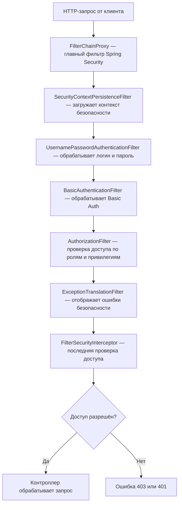

# Безопасность Web-приложений. Spring security

## Введение в Spring Security

Spring Security является основным инструментом реализации безопасности на уровне приложений в Spring. Как правило, его цель – предложить вам настраиваемый способ реализации аутентификации, авторизации и защиты от распространенных атак. Spring Security – это программное обеспечение с открытым исходным кодом, выпущенное по лицензии Apache 2.0. Вы можете получить доступ к его исходному коду на GitHub по адресу <https://github.com/spring-projects/spring-security/>.

Spring Security предоставляет:

+ Аутентификацию (проверка личности пользователя)
+ Авторизацию (проверка прав пользователя)
+ Защиту от атак: CSRF, session fixation, clickjacking и др.
+ Интеграцию с базой данных, LDAP, OAuth2 и другими системами

Интернет — открытая среда, и приложения могут быть атакованы извне. Spring Security помогает защититься от таких угроз:

| Тип атаки                     | Что делает Spring Security                                      |
|------------------------------|------------------------------------------------------------------|
| **Brute force (перебор паролей)** | Блокировка или замедление повторных попыток входа             |
| **CSRF (подделка запросов)**     | Генерация и проверка CSRF-токена в формах                     |
| **XSS (внедрение скриптов)**     | Помогает при правильной конфигурации шаблонизаторов           |
| **Session fixation**             | Меняет session ID после логина                                |
| **Clickjacking**                 | Защищает от внедрения сайта в iframe                          |


Безопасность — это не только «блокировать». Это ещё и гибкий доступ, когда:

+ каждый пользователь видит только своё
+ роли (USER, ADMIN) и привилегии (READ_PRIVILEGE, EDIT_PROFILE) чётко разграничивают возможности

Многие организации обязаны:

+ защищать данные пользователей (например, по законам ЕС)
+ обеспечивать безопасный вход в систему
+ вести лог действий пользователей

Spring Security помогает соответствовать этим требованиям из коробки.

| **Безопасность — это не опция, а необходимость.** |
|--|

### Архитектура Spring Security

В стандартном Java EE/Servlet API, фильтр — это компонент, который перехватывает HTTP-запрос до того, как он попадёт в сервлет (или контроллер), и может:

+ Изменить запрос или ответ
+ Сделать проверку (например, авторизован ли пользователь)
+ Отклонить доступ или перенаправить

Фильтр реализуется через интерфейс javax.servlet.Filter.

```java
public class MyFilter implements Filter {
    public void doFilter(ServletRequest request, ServletResponse response, FilterChain chain) {
        // логика перед контроллером
        chain.doFilter(request, response); // передаём дальше
        // логика после контроллера (если надо)
    }
}
```

Spring Security построен на цепочке фильтров, где каждый фильтр отвечает за свою часть:

+ один фильтр — проверяет логин/пароль (form login) - UsernamePasswordAuthenticationFilter
+ другой — обрабатывает Basic Auth - BasicAuthenticationFilter
+ ещё один — разбирает токен
+ ещё один — отлавливает ошибки и показывает нужную страницу - ExceptionTranslationFilter

Эта система называется Security Filter Chain, и она управляется классом FilterChainProxy.

### Понятия: Authentication, Authorization, Principal, GrantedAuthority

**Authentication** — процесс проверки личности пользователя

+ Пример: проверка логина/пароля в форме
+ Результатом является Authentication-объект

**Authorization** — проверка, имеет ли пользователь доступ к ресурсу

+ Пример: доступ к /admin только для пользователей с ролью ADMIN

**Principal** — идентификатор текущего пользователя

+ Представлен через интерфейс Principal или UserDetails

**GrantedAuthority** — права/полномочия пользователя

+ Обычно представляют роли и привилегии: ROLE_ADMIN, READ_PRIVILEGE

### Как работает фильтрация запросов (FilterChainProxy)

Порядок работы при каждом HTTP-запросе:

+ Запрос перехватывается FilterChainProxy
+ Запускается цепочка фильтров (в порядке, заданном в конфигурации)
+ Фильтр аутентификации (UsernamePasswordAuthenticationFilter или BasicAuthenticationFilter) проверяет данные
+ Если успешно — создаётся Authentication-объект и сохраняется в SecurityContext
+ Далее проверяется авторизация (по ролям, привилегиям и т.п.)
+ Если доступ разрешён — запрос доходит до контроллера
+ Если нет — отображается ошибка (403/401)



## Настройка Spring Security в non-Boot (классическом) Spring-проекте

### build.gradle.kts — зависимости и конфигурация

``` kotlin
// Spring Security
    implementation("org.springframework.security:spring-security-web:6.2.2")
    implementation("org.springframework.security:spring-security-config:6.2.2")
```

### Активация цепочки фильтров

Для активации цепочки фильтров проект должен содержать реализацию AbstractSecurityWebApplicationInitializer, например SecurityInitializer.java

``` java
package ru.bsuedu.cad.demo;


import org.springframework.security.web.context.AbstractSecurityWebApplicationInitializer;

public class SecurityInitializer extends AbstractSecurityWebApplicationInitializer {
}
```

### Конфигурация

Современный способ конфигурации Spring Security — это Java-based configuration через бин SecurityFilterChain.

```java

@Configuration
@EnableWebSecurity(debug = true)
public class ConfigSecurity {
    @Bean
    public SecurityFilterChain filterChain(HttpSecurity http) throws Exception {
        http
                .authorizeHttpRequests(authz -> authz
                                .requestMatchers("/", "/login", "/public/**").permitAll()
                                .requestMatchers("/students/new").hasRole( "ADMIN")
                                .requestMatchers("/students/**").hasAnyRole("USER", "ADMIN")
                                .requestMatchers("/api/**").hasRole( "API")
                                .anyRequest().authenticated()
                )
                .formLogin(form -> form
                                .loginPage("/login")
                                .loginProcessingUrl("/login")
                                .defaultSuccessUrl("/students", true)
                                .failureUrl("/login?error")
                                .permitAll()
                )
                .httpBasic(Customizer.withDefaults())
                .logout(logout -> logout
                                .logoutUrl("/logout")
                                .logoutSuccessUrl("/login?logout")
                                .permitAll()
                )
                .csrf(csrf -> csrf.disable());

        return http.build();
    }

    @Bean
    public UserDetailsService userDetailsService() {
        return new InMemoryUserDetailsManager(
            User.withUsername("user")
                .password("{noop}1234")
                .roles("USER")
                //.authorities("VIEW_PROFILE")
                .build(),
            User.withUsername("admin")
                .password("{noop}admin")
                .roles("ADMIN")
                ///.authorities("VIEW_PROFILE", "EDIT_PROFILE", "DELETE_USERS")
                .build(),
            User.withUsername("api")
                .password("{noop}api")
                .roles("API")
                ///.authorities("VIEW_PROFILE", "EDIT_PROFILE", "DELETE_USERS")
                .build()
        );
    }
}
```

### AuthenticationManager

AuthenticationManager — это ядро механизма аутентификации в Spring Security. Его задача — проверять логин и пароль пользователя, чтобы понять, кто он и имеет ли он право входа в систему.

AuthenticationManager получает объект типа Authentication (например, UsernamePasswordAuthenticationToken), и пытается его аутентифицировать. Если всё ок — возвращает аутентифицированный объект с информацией о пользователе и его ролях.

1. Пользователь вводит логин и пароль
2. Spring создает Authentication (например, UsernamePasswordAuthenticationToken)
3. AuthenticationManager проверяет их (обычно через UserDetailsService)
4. Если успешно → возвращает аутентифицированного пользователя (Authentication)
5. Spring помещает его в SecurityContext → пользователь вошел в систему

```java
@Bean
public AuthenticationManager authManager(HttpSecurity http) throws Exception {
    AuthenticationManagerBuilder authBuilder = http.getSharedObject(AuthenticationManagerBuilder.class);
    authBuilder
        .userDetailsService(myUserDetailsService)
        .passwordEncoder(passwordEncoder());
    return authBuilder.build();
}
```


## Аутентификация на основе формы (Form Login)

Аутентификация на основе формы — это способ входа в систему, при котором пользователь заполняет HTML-форму с логином и паролем. Этот способ наиболее привычен в веб-приложениях.


| Этап | Описание                                                                 |
|------|--------------------------------------------------------------------------|
| 1  | Пользователь открывает страницу входа (`/login`)                         |
| 2  | Вводит логин и пароль, форма отправляется методом `POST`                 |
| 3 | Spring Security перехватывает `/login` и обрабатывает логин             |
| 4  | Если данные корректны → пользователь считается аутентифицированным      |
| 5  | Spring сохраняет информацию о пользователе в `SecurityContext`          |
| 6 | Перенаправление на целевую страницу или `defaultSuccessUrl`             |


Настройка

``` java
@Bean
public SecurityFilterChain filterChain(HttpSecurity http) throws Exception {
    http
        .authorizeHttpRequests(authz -> authz
            .requestMatchers("/login", "/css/**").permitAll()
            .anyRequest().authenticated()
        )
        .formLogin(form -> form
            .loginPage("/login")                         // своя страница логина
            .loginProcessingUrl("/login")               // URL, куда отправляется POST-запрос
            .defaultSuccessUrl("/", true)               // куда перенаправлять после успешного входа
            .failureUrl("/login?error")                 // куда при ошибке
            .permitAll()
        )
        .logout(logout -> logout
            .logoutUrl("/logout")
            .logoutSuccessUrl("/login?logout")
            .permitAll()
        );
    return http.build();
}
```

Форма логина должна отправлять данные на POST /login, с параметрами:

+ username — имя пользователя
+ password — пароль

```html
<!DOCTYPE html>
<html xmlns:th="http://www.thymeleaf.org">
<head>
    <meta charset="UTF-8">
    <title>Вход</title>
    <link rel="stylesheet" th:href="@{/css/bootstrap.min.css}" />
</head>
<body class="container pt-5">

<h2>Вход в систему</h2>

<form th:action="@{/login}" method="post" class="form-group">
    <label for="username">Логин:</label>
    <input type="text" id="username" name="username" class="form-control" />

    <label for="password" class="mt-2">Пароль:</label>
    <input type="password" id="password" name="password" class="form-control" />

    <button type="submit" class="btn btn-primary mt-3">Войти</button>
</form>

<div th:if="${param.error}">
    <p class="text-danger">Неверный логин или пароль</p>
</div>

<div th:if="${param.logout}">
    <p class="text-success">Вы вышли из системы</p>
</div>

</body>
</html>
```

После входа:

+ Информация сохраняется в SecurityContextHolder
+ Можно получить пользователя в контроллере через @AuthenticationPrincipal или Principal

``` java
@GetMapping("/profile")
public String profile(@AuthenticationPrincipal UserDetails user, Model model) {
    model.addAttribute("username", user.getUsername());
    return "profile";
}
```

После аутентификации, можно использовать .hasRole(...), .hasAuthority(...) и т.д. для авторизации

```java
.authorizeHttpRequests(authz -> authz
    .requestMatchers("/admin/**").hasRole("ADMIN")
    .requestMatchers("/user/**").hasAnyRole("USER", "ADMIN")
)
```

### Basic Authentication 

Basic Authentication — это простой механизм аутентификации, при котором имя пользователя и пароль передаются в HTTP-заголовке Authorization в каждом запросе. Данные кодируются в Base64, но не шифруются, поэтому всегда следует использовать HTTPS.

| Этап | Описание                                                                 |
|------|--------------------------------------------------------------------------|
| 1  | Клиент (например, браузер или Postman) делает запрос к защищенному ресурсу |
| 2  | Сервер отвечает `401 Unauthorized` с заголовком `WWW-Authenticate: Basic` |
| 3  | Клиент повторяет запрос, добавляя заголовок `Authorization: Basic <base64(username:password)>` |
| 4 | Spring Security извлекает и проверяет данные                            |
| 5  | В случае успеха пользователь считается аутентифицированным              |


### Конфигурация в SecurityFilterChain

``` java
    @Bean
    public SecurityFilterChain filterChain(HttpSecurity http) throws Exception {
        http
            .authorizeHttpRequests(authz -> authz
                .requestMatchers("/api/public/**").permitAll()
                .anyRequest().authenticated()
            )
            .httpBasic(Customizer.withDefaults()) // включает basic auth
            .csrf(csrf -> csrf.disable());        // желательно отключить CSRF для REST API
        return http.build();
    }
```

Метод http.httpBasic() подключает фильтр BasicAuthenticationFilter.

+ Basic Auth всегда требует HTTPS — иначе логин и пароль можно перехватить.
+ Подходит для микросервисов или тестирования.
+ Spring Security не сохраняет сессию, если не настроено дополнительно.

## Роли и авторизация

Авторизация — это процесс определения, имеет ли пользователь доступ к определенному ресурсу после успешной аутентификации.

Spring Security использует концепции ролей и привилегий (authorities), чтобы управлять правами доступа

| Понятие            | Описание                                                              |
|--------------------|-----------------------------------------------------------------------|
| **Роль (Role)**     | Группа прав, например `ROLE_USER`, `ROLE_ADMIN`                      |
| **Привилегия (Authority)** | Конкретное разрешение, например `VIEW_PROFILE`, `EDIT_PROFILE`      |
| **hasRole("USER")** | Проверка наличия роли `ROLE_USER`                                     |
| **hasAuthority("EDIT_PROFILE")** | Проверка наличия конкретной привилегии `EDIT_PROFILE`            |


Настройка   ролей и привилегий

```java
http
    .authorizeHttpRequests(authz -> authz
        .requestMatchers("/admin/**").hasRole("ADMIN")
        .requestMatchers("/profile/edit").hasAuthority("EDIT_PROFILE")
        .requestMatchers("/students/**").hasAnyRole("USER", "ADMIN")
        .requestMatchers("/", "/login", "/public/**").permitAll()
        .anyRequest().authenticated()
    )

```


Присвоение ролей и привилегий

```java
@Bean
public UserDetailsService userDetailsService() {
    return new InMemoryUserDetailsManager(
        User.withUsername("user")
            .password("{noop}1234")
            .roles("USER") // эквивалентно authority ROLE_USER
            .authorities("VIEW_PROFILE")
            .build(),

        User.withUsername("admin")
            .password("{noop}admin")
            .roles("ADMIN")
            .authorities("VIEW_PROFILE", "EDIT_PROFILE", "DELETE_USERS")
            .build()
    );
}
```

Проверка ролей и привилегий

``` html
<!-- Проверка роли -->
<div sec:authorize="hasRole('ADMIN')">
    Это видят только админы
</div>

<!-- Проверка привилегии -->
<div sec:authorize="hasAuthority('EDIT_PROFILE')">
    Это видят пользователи с правом редактирования
</div>

```

```java

import org.springframework.security.access.prepost.PreAuthorize;
import org.springframework.web.bind.annotation.GetMapping;
import org.springframework.web.bind.annotation.RestController;

@RestController
public class UserController {

    @GetMapping("/admin")
    @PreAuthorize("hasRole('ADMIN')")
    public String getAdminPage() {
        return "This is an Admin page.";
    }

    @GetMapping("/user")
    @PreAuthorize("hasRole('USER')")
    public String getUserPage() {
        return "This is a User page.";
    }

    @GetMapping("/both")
    @PreAuthorize("hasAnyRole('ADMIN', 'USER')")
    public String getBothPage() {
        return "This is a page for both Admin and User.";
    }
}

```

Если используется аннотация @PreAuthorize, необходимо включить поддержку предварительных проверок с помощью аннотации @EnableGlobalMethodSecurity в конфигурации.

```java
import org.springframework.security.config.annotation.web.configuration.EnableWebSecurity;
import org.springframework.security.config.annotation.web.configuration.WebSecurityConfigurerAdapter;
import org.springframework.security.config.annotation.web.builders.HttpSecurity;
import org.springframework.security.config.annotation.web.configuration.EnableGlobalMethodSecurity;

@EnableWebSecurity
@EnableGlobalMethodSecurity(prePostEnabled = true)
public class SecurityConfig extends WebSecurityConfigurerAdapter {
    @Override
    protected void configure(HttpSecurity http) throws Exception {
        http
            .authorizeRequests()
            .antMatchers("/admin/**").hasRole("ADMIN")
            .antMatchers("/user/**").hasRole("USER")
            .anyRequest().authenticated();
    }
}
```