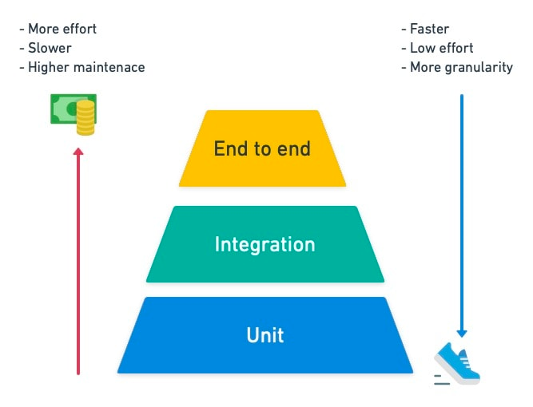
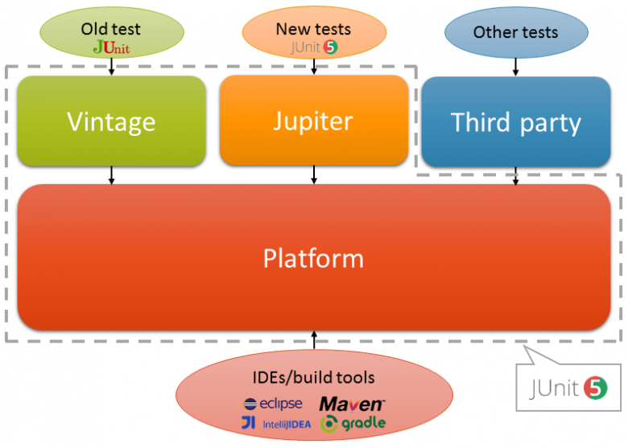
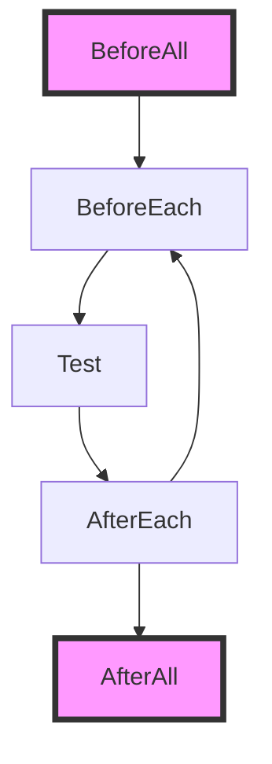
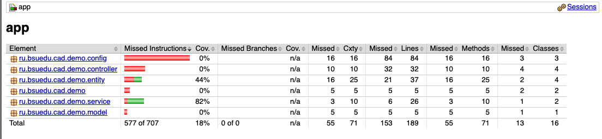

# Тестирование приложений.  Unit тестирование

## Введение

**Тестирование программного обеспечения (Software Testing)** — проверка соответствия реальных и ожидаемых результатов поведения программы, проводимая на конечном наборе тестов, выбранном определённым образом.

Цель тестирования — проверка соответствия ПО предъявляемым требованиям, обеспечение уверенности в качестве ПО, поиск очевидных ошибок в программном обеспечении, которые должны быть выявлены до того, как их обнаружат пользователи программы.

Для чего проводится тестирование ПО?

+ Для проверки соответствия требованиям.
+ Для обнаружения проблем на более ранних этапах разработки и предотвращения повышения стоимости продукта.
+ Обнаружения вариантов использования, которые не были предусмотрены при разработке. А также взгляд на продукт со стороны пользователя.
+ Повышения лояльности к компании и продукту, т.к. любой обнаруженный дефект негативно влияет на доверие пользователей.

## Уровни тестирования

+ Модульное тестирование (юнит) - юнит тесты находят ошибки на фундаментальных уровнях, их легче разрабатывать и поддерживать. Важное преимущество модульных тестов в том, что они быстрые и при изменении кода позволяют быстро провести регресс (убедиться, что новый код не сломал старые части кода);
  
+ Интеграционное тестирование - Проверят взаимосвязь компоненты, которую проверяли на модульном уровне, с другой или другими компонентами, а также интеграцию компоненты с системой (проверка работы с ОС, сервисами и службами, базами данных, железом и т.д.). Часто в английских статьях называют service test или API test.

+ Приемочное тестирование -  часто называют E2E тестами (End-2-End) или сквозными. На этом уровне происходит валидация требований (проверка работы ПО в целом, не только по прописанным требованиям, что проверили на системном уровне).



Пирамида тестирования, также часто говорят уровни тестирования, это группировка тестов по уровню детализации и их назначению. Эту абстракцию придумал Майк Кон и описал в книге «Scrum: гибкая разработка ПО»

### Что такое Unit-тестирование?

**Модульное тестирование, или юнит-тестирование** (англ. unit testing) — процесс в программировании, позволяющий проверить на корректность отдельные модули исходного кода программы.

Идея состоит в том, чтобы писать тесты для каждой нетривиальной функции или метода. Это позволяет достаточно быстро проверить, не привело ли очередное изменение кода к регрессии, то есть к появлению ошибок в уже оттестированных местах программы, а также облегчает обнаружение и устранение таких ошибок.

Цель: проверить, что данная единица кода (unit) работает корректно и независимо от других частей системы.
Unit-тесты обычно выполняются быстро и не требуют реального окружения (БД, сетевых соединений и т.д.).

### Зачем писать Unit-тесты?

+ Раннее обнаружение ошибок: быстрее находим баги еще до интеграции.
+ Документация кода: хорошо написанный тест объясняет, как должен работать код.
+ Упрощение рефакторинга: тесты гарантируют, что изменения не сломают существующую логику.
+ Экономия времени: быстрое обнаружение проблем экономит время на этапе тестирования вручную.
+ Повышение уверенности в коде: позволяет быть уверенным в его корректности.

### Отличие Unit-тестов от Интеграционных тестов

| Критерий               | Unit-тесты                          | Интеграционные тесты                 |
|-------------------------|-------------------------------------|--------------------------------------|
| Объект тестирования     | Один класс или метод                | Взаимодействие между несколькими классами |
| Окружение               | Моки и стабы                        | Реальные зависимости (БД, серверы)  |
| Скорость выполнения     | Очень высокая                      | Средняя или низкая                  |
| Сложность               | Низкая                              | Выше средней                        |
| Поднятие Spring контекста| Обычно нет                          | Обычно да                           |
| Цель                    | Проверить поведение отдельной единицы | Проверить совместную работу компонентов |
| Изоляция                | Высокая                             | Частичная                           |
| Стоимость ошибок        | Низкая                              | Выше, из-за вовлеченности нескольких слоёв |

В Unit-тестах нет подключения к настоящим базам данных, серверам и др.

### Где размещаются тесты в проекте

По стандарту Maven/Gradle тесты размещаются в src/test/java
Структура каталогов тестов зеркалит структуру основного кода

``` bash
src/main/java/com/example/service/UserService.java
src/test/java/com/example/service/UserServiceTest.java
```

Хорошая практика: на каждый класс бизнес-логики — свой тестовый класс.

## Инструменты и зависимости для Unit-тестирования на Spring

+ **JUnit**. фреймворк для тестирования Java-приложений. Предоставляет аннотации и классы для определения и запуска тестов, а также для проверки ожидаемых результатов. JUnit значительно облегчает создание и выполнение тестовых сценариев.

  + JUnit Jupiter: включает новые модели программирования и расширения для написания тестов. В нем есть все новые аннотации junit и TestEngine реализация для запуска тестов, написанных с этими аннотациями.

  + Платформа JUnit: чтобы иметь возможность запускать тесты junit, IDE, инструменты сборки или плагины должны включать и расширять API платформы. Он определяет TestEngine API для разработки новых фреймворков тестирования, работающих на платформе. Он также предоставляет средство запуска консоли для запуска платформы из командной строки и создания подключаемых модулей для Gradle и Maven.

  + JUnit Vintage: его основная цель - поддерживать выполнение на платформе JUnit 5 тестов, написанных для JUnit 3 и JUnit 4. Это есть обратная совместимость.
  


+ **Mockito**. Библиотека для создания моков (фиктивных объектов) в тестах. Позволяет настроить поведение моков и проверить, как взаимодействует тестируемый код с этими моками.В Mockito есть несколько типов объектов для тестирования:
  
  + Mock — это фиктивный объект, который можно настроить так, чтобы он возвращал определенные значения из вызовов методов. Например, у нас есть класс с методами A, B и C. Мы хотим протестировать метод A, при этом вызовы методов B и C не должны выполняться. Чтобы «заглушить» вызовы B и C и вернуть заданный результат, используем mock.

  + Spy — это полностью функционирующий объект. Если нам нужно проверить, вызывался ли метод B из метода A, используем spy. Spy позволяет отслеживать вызовы всех методов объекта и проверять их.

**AssertJ**. Библиотека для создания утверждений в тестах. Предоставляет более выразительные методы для проверки ожидаемых результатов, что делает тесты более читаемыми и понятными.

**JaCoCo** (Java Code Coverage). Инструмент, который измеряет покрытие кода тестами. Анализирует выполнение тестов и предоставляет отчеты о покрытии, позволяя определить, какие части кода были протестированы, а какие — нет. JaCoCo помогает локализовать недостаточно протестированные участки кода и повышает качество тестирования.

## Настройка проекта для тестирования

### Подключение зависимостей и настройка задачи тестирования

``` kotlin
dependencies {
    // JUnit Jupiter API и Engine
    testImplementation("org.junit.jupiter:junit-jupiter-api:5.11.1")
    testRuntimeOnly("org.junit.jupiter:junit-jupiter-engine:5.11.1")

    // Mockito Core
    testImplementation("org.mockito:mockito-core:5.17.0")
    testImplementation("org.mockito:mockito-junit-jupiter:5.17.0")

    // Spring Test (для работы с контекстом Spring в тестах)
    // testImplementation("org.springframework:spring-test:6.2.2")

    // (опционально) Библиотека для улучшенных assert'ов
    testImplementation("org.assertj:assertj-core:3.25.3")
}
```

``` kotlin
tasks.named<Test>("test") {
    // Use JUnit Platform for unit tests.
    useJUnitPlatform()
}

```

### Структура проекта

Структура каталогов тестов зеркалит структуру основного кода

``` text
/src
 ├── /main
 │    ├── /java
 │    │    ├── ru
 │    │    │    ├── bsuedu
 │    │    │    │    ├── cad
 │    │    │    │    │    ├── demo
 │    │    │    │    │    │    ├── service
 │    │    │    │    │    │    ├── repository
 │    │    │    │    │    │    ├── entity
 │    │    │    │    │    │    ├── config
 │    │    │    │    │    │    ├── controller
 │    ├── /resources
 │    │    ├── application.properties
 │    │    ├── application.yml
 ├── /test
 │    ├── /java
 │    │    ├── ru
 │    │    │    ├── bsuedu
 │    │    │    │    ├── cad
 │    │    │    │    │    ├── demo
 │    │    │    │    │    │    ├── service
 │    │    │    │    │    │    ├── repository
 │    │    │    │    │    │    ├── entity
 │    │    │    │    │    │    ├── controller
 │    │    ├── /resources
 │    │    ├── test-application.properties
 ```

1. Тесты должны находиться в отдельной папке src/test/java. Это позволяет держать код приложения и тесты отдельно.
2. Ресурсы тестов (например, test-application.properties) должны находиться в src/test/resources. Это поможет избежать конфликтов с основными конфигурациями.

### Жизненный цикл теста в JUnit 5

В JUnit 5 жизненный цикл теста организован через различные аннотации, которые управляют подготовкой и завершением тестов, а также позволяют выполнять действия до и после различных фаз выполнения тестов. Вот ключевые элементы жизненного цикла теста в JUnit 5:



1. @BeforeAll и @AfterAll
   + @BeforeAll: Этот метод выполняется один раз до всех тестов в классе. Он должен быть статическим (static), так как вызывается до создания экземпляра тестового класса.
   + @AfterAll: Этот метод выполняется один раз после всех тестов в классе. Также должен быть статическим.

``` java
@BeforeAll
static void initAll() {
    System.out.println("Выполняется до всех тестов");
}

@AfterAll
static void tearDownAll() {
    System.out.println("Выполняется после всех тестов");
}
```

2. @BeforeEach и @AfterEach
   + @BeforeEach: Этот метод выполняется перед каждым тестом в классе.
   + @AfterEach: Этот метод выполняется после каждого теста в классе.

``` java
@BeforeEach
void init() {
    System.out.println("Выполняется перед каждым тестом");
}

@AfterEach
void tearDown() {
    System.out.println("Выполняется после каждого теста");
}
```

3. @Test
   + Основная аннотация для тестов. Методы с этой аннотацией будут выполняться как отдельные тесты.

``` java
@Test
void testSomething() {
    System.out.println("Это тест");
}
```

### Принцип “Arrange-Act-Assert”

Принцип “Arrange-Act-Assert” (AAA) — это шаблон организации тестов, который помогает сделать их более читаемыми и понятными. Этот принцип разделяет тест на три основные части:

1. Arrange (Подготовка)

В этой части теста происходит подготовка всех данных и объектов, которые будут использоваться в тесте. Это включает в себя создание экземпляров классов, инициализацию необходимых переменных, а также настройку зависимостей.

```java
Calculator calculator = new Calculator();
int a = 5;
int b = 3;
```

2. Act (Действие)

На этом этапе вызывается тестируемый метод или выполняется операция, которая будет проверяться в тесте. Это фактическое выполнение теста.

``` java
int result = calculator.add(a, b);
```

3. Assert (Проверка)

Здесь проверяется, соответствует ли результат теста ожиданиям. Обычно это делается с помощью утверждений (assertions), которые проверяют, вернул ли метод правильное значение.

```java
assertEquals(8, result);
```

И все месте

``` java
@Test
void testAdd() {
    // Arrange
    Calculator calculator = new Calculator();
    int a = 5;
    int b = 3;

    // Act
    int result = calculator.add(a, b);

    // Assert
    assertEquals(8, result);
}
```

### Принцип Given-When-Then

Принцип Given-When-Then (GWT) — это ещё одна популярная структура для написания тестов, особенно в контексте Behavior-Driven Development (BDD). Он помогает описать поведение системы с точки зрения пользователя и разрабатывается как сценарий, который можно легко понять не только разработчикам, но и другим заинтересованным сторонам (например, бизнес-аналитикам). Это также структура для написания тестов, и её основной принцип заключается в разделении теста на три части: Given, When и Then.

Основные компоненты Given-When-Then:

1. Given (Дано) — Эта часть описывает начальное состояние системы или контекст. Устанавливаются все необходимые условия и начальные данные для теста. Это аналогично Arrange в принципе AAA.
2. When (Когда) — Описывается действие, которое нужно выполнить в тесте. Это то, что вызывает изменение состояния системы, например, вызов метода. Это аналогично Act в AAA.
3. Then (Тогда) — В этой части описываются ожидаемые результаты или поведение системы после выполнения действия. Это аналогично Assert в AAA.

```java
@Test
void testAdd() {
    // Given: Подготовка данных
    Calculator calculator = new Calculator();
    int a = 5;
    int b = 3;

    // When: Выполнение действия
    int result = calculator.add(a, b);

    // Then: Проверка результата
    assertEquals(8, result);
}
```

Выбор между AAA и Given-When-Then зависит от контекста проекта. AAA отлично подходит для традиционных юнит-тестов, в то время как Given-When-Then — для сценариев с поведенческим фокусом, где важно взаимодействие с бизнесом и описание функционала на высоком уровне.

## Использование моков в тестах

Моки (Mocks) — это объекты, которые имитируют поведение реальных объектов в тестах. Использование моков позволяет изолировать тестируемую логику от зависимостей, что делает тесты более надежными и предсказуемыми.

В реальных приложениях компоненты часто зависят друг от друга. Например, сервис может обращаться к базе данных, внешним API или другим сервисам. На практике, чтобы протестировать только логику одного компонента, часто бывает неудобно или невозможно работать с реальными зависимостями. В таких случаях на помощь приходят моки, которые позволяют:

+ Изолировать тестируемый компонент.
+ Контролировать поведение зависимостей (например, вернуть заранее определенные значения).
+ Проверять взаимодействие с зависимостями (например, сколько раз был вызван тот или иной метод).

Предположим, у нас есть следующий класс-сервис:

``` java
public class OrderService {
    private final OrderRepository orderRepository;

    public OrderService(OrderRepository orderRepository) {
        this.orderRepository = orderRepository;
    }

    public double calculateTotalPrice(Long orderId) {
        Order order = orderRepository.findById(orderId);
        if (order == null) {
            throw new OrderNotFoundException("Order not found");
        }
        return order.getItems().stream().mapToDouble(Item::getPrice).sum();
    }
}
```

В данном примере класс OrderService зависит от репозитория OrderRepository. Чтобы протестировать метод calculateTotalPrice, нам необходимо замокать OrderRepository, так как мы не хотим взаимодействовать с реальной базой данных в тестах.

Шаги для создания теста с моками:

1. Создание моков: Используем Mockito для создания мока репозитория.
2. Настройка поведения мока: Определяем, что моки должны возвращать при вызове определенных методов.
3. Проверка результатов: Выполняем метод сервиса и проверяем результат.

``` java
import static org.mockito.Mockito.*;
import static org.junit.jupiter.api.Assertions.*;

import org.junit.jupiter.api.BeforeEach;
import org.junit.jupiter.api.Test;
import org.mockito.*;

public class OrderServiceTest {
    
    @Mock
    private OrderRepository orderRepository;  // Мок репозитория

    private OrderService orderService;  // Тестируемый сервис

    @BeforeEach
    void setUp() {
        MockitoAnnotations.openMocks(this);  // Инициализация моков
        orderService = new OrderService(orderRepository);
    }

    @Test
    void calculateTotalPrice_shouldReturnCorrectTotal() {
        // Given: Подготовка данных
        Order order = mock(Order.class);  // Мок объекта заказа
        Item item1 = new Item("Item1", 10.0);
        Item item2 = new Item("Item2", 15.0);

        when(orderRepository.findById(1L)).thenReturn(order);  // Настройка мока репозитория
        when(order.getItems()).thenReturn(List.of(item1, item2));  // Настройка мока заказа

        // When: Выполнение действия
        double totalPrice = orderService.calculateTotalPrice(1L);  // Вызов метода

        // Then: Проверка результата
        assertEquals(25.0, totalPrice);  // Проверка ожидаемой суммы
    }

    @Test
    void calculateTotalPrice_shouldThrowExceptionIfOrderNotFound() {
        // Given: Репозиторий не находит заказ
        when(orderRepository.findById(1L)).thenReturn(null);

        // When / Then: Проверка на выброс исключения
        assertThrows(OrderNotFoundException.class, () -> orderService.calculateTotalPrice(1L));
    }
}
```

1. @Mock: Аннотация для создания мока. В данном случае мы замокаем OrderRepository.
2. MockitoAnnotations.openMocks(this): Метод инициализирует моки в тесте.
3. when(…).thenReturn(…): Настройка поведения мока. Когда вызывается метод findById(1L), он возвращает замоканный объект Order.
4. assertEquals: Проверка, что результат метода calculateTotalPrice равен ожидаемой сумме.
5. assertThrows: Проверка, что метод calculateTotalPrice выбрасывает исключение OrderNotFoundException, если заказ не найден.

Mockito предлагает несколько полезных функций для работы с моками:

+ Верификация вызова методов: Проверка, что методы мока были вызваны определенное количество раз.

``` java
verify(orderRepository, times(1)).findById(1L);  // Проверка, что метод findById был вызван один раз
```

+ ArgumentCaptor: Для захвата аргументов, переданных в метод мока, для более детальной проверки.
  
``` java
ArgumentCaptor<Long> captor = ArgumentCaptor.forClass(Long.class);
verify(orderRepository).findById(captor.capture());
assertEquals(1L, captor.getValue())
```

Использование моков в тестах с JUnit 5 и Mockito позволяет изолировать тестируемую логику от реальных зависимостей и ускорить процесс тестирования. Это помогает создавать более надежные и предсказуемые тесты. Mockito предоставляет мощные инструменты для настройки поведения моков, верификации вызовов и захвата аргументов, что делает его одним из самых популярных инструментов для юнит-тестирования в Java.

## JaCoCo

JaCoCo — это инструмент для анализа покрытия кода тестами в проектах на Java. Он помогает определить, какие части кода были протестированы, а какие — нет, и предоставляет подробную информацию о покрытии, что позволяет разработчикам улучшить качество тестирования.

Основные возможности JaCoCo:

+ Покрытие строк кода: JaCoCo предоставляет статистику о том, какие строки были выполнены во время тестов.
+ Покрытие методов и классов: Он также может измерять, какие методы и классы были затронуты тестами.
+ Поддержка различных форматов отчетов: JaCoCo генерирует отчеты в форматах HTML, XML и CSV, которые легко можно интегрировать в процессы CI/CD.
+ Поддержка инструментов сборки: JaCoCo интегрируется с популярными инструментами сборки, такими как Maven и Gradle, и может быть использован как часть автоматических тестов.

JaCoCo работает путем вставки специальных команд в байт-код Java-программы, которые отслеживают выполнение кода. Эти команды не влияют на поведение программы, но позволяют собирать статистику о выполненных строках, методах и классах.

``` kotlin
plugins {
    // Apply the application plugin to add support for building a CLI application in Java.
    java
    war
    jacoco
}

repositories {
    // Use Maven Central for resolving dependencies.
    mavenCentral()
}

dependencies {

    // JUnit Jupiter API и Engine
    testImplementation("org.junit.jupiter:junit-jupiter-api:5.11.1")
    testRuntimeOnly("org.junit.jupiter:junit-jupiter-engine:5.11.1")

    // Mockito Core
    testImplementation("org.mockito:mockito-core:5.17.0")
    testImplementation("org.mockito:mockito-junit-jupiter:5.17.0")

    // Spring Test (для работы с контекстом Spring в тестах)
    testImplementation("org.springframework:spring-test:6.2.2")

    // (опционально) Библиотека для улучшенных assert'ов
    testImplementation("org.assertj:assertj-core:3.25.3")

    testRuntimeOnly("org.junit.platform:junit-platform-launcher")
}

// Apply a specific Java toolchain to ease working on different environments.
java {
    toolchain {
        languageVersion = JavaLanguageVersion.of(17)
    }
}

tasks.war {
    archiveFileName.set("university.war")
}

tasks.named<Test>("test") {
    // Use JUnit Platform for unit tests.
    useJUnitPlatform()
    finalizedBy(tasks.jacocoTestReport)
}

tasks.jacocoTestReport {
    dependsOn(tasks.test) // tests are required to run before generating the report
    reports {
        xml.required = false
        csv.required = false
 }
     
```
Отчет можно увидеть в директории app/build/jacocoHtml после запуска команды ```gradle test```




## Написанию хороших тестов

Тестирование играет ключевую роль в разработке программного обеспечения, так как помогает выявлять ошибки, улучшать качество кода и ускорять процесс разработки. Однако важно, чтобы тесты были написаны качественно, иначе они могут стать источником проблем и усложнить поддержку проекта. Вот несколько советов, которые помогут писать хорошие, надежные и эффективные тесты.

1. Покрытие кода не всегда означает хорошее тестирование

Хотя высокий процент покрытия кода тестами может показаться важным, это не гарантирует, что тесты действительно проверяют все важные аспекты программы. Лучше сосредоточиться на покрытии логики, а не на всех строках кода. Тесты должны проверять функциональность, а не просто проверять, что код выполняется.

2. Следуй принципам Arrange-Act-Assert (AAA)

Каждый тест должен быть четко структурирован:

+ Arrange — подготовка данных и объектов, необходимых для теста.
+ Act — выполнение действия или вызов тестируемого метода.
+ Assert — проверка, что результат соответствует ожиданиям.

Это помогает улучшить читаемость тестов и делает их логичными и понятными.

3. Тесты должны быть быстрыми

Тесты, которые выполняются слишком долго, могут замедлить процесс разработки и тестирования. Меньше времени на тесты — больше времени для разработки. Избегайте сложных зависимостей, особенно тех, которые требуют взаимодействия с внешними сервисами (например, базами данных или API), в юнит-тестах.

Для долгих операций используйте моки и заглушки для замены реальных зависимостей.

4. Напиши читаемые и понятные тесты

Тесты должны быть не только технически правильными, но и легко читаемыми. Они должны быть такими же понятными, как и документация к коду. Четкие и лаконичные имена методов, комментарии и разделение на логические блоки помогут вам и вашим коллегам быстрее понять, что проверяется в тестах.

5. Используй осмысленные имена тестов

Имя теста должно четко описывать, что он проверяет. Вместо имен вроде test1(), test2(), используйте более описательные имена, например: shouldReturnTrueWhenInputIsValid(), shouldThrowExceptionWhenOrderNotFound().

6. Не тестируй слишком много в одном тесте

Каждый тест должен проверять одну единственную вещь. Чем меньше логики в одном тесте, тем проще его поддерживать и изменять. Тесты с несколькими утверждениями могут быть трудными для отладки и понимания, особенно если они ломаются.

7. Изолированность тестов

Каждый тест должен быть независимым от других. Не следует полагаться на состояние других тестов или изменять глобальные переменные. Это помогает избежать ошибок, когда один тест ломает другие, и позволяет параллельно запускать тесты.

8. Пиши тесты до реализации (TDD)

Применение подхода Test-Driven Development (TDD) позволяет создавать тесты до написания кода. Это помогает убедиться, что код будет работать корректно, и уменьшает вероятность появления багов. TDD также помогает лучше понять требования и спецификации задачи до начала кодирования.

Пример TDD:
	1.	Напиши тест (который не пройдет).
	2.	Напиши минимальный код, чтобы пройти тест.
	3.	Рефакторинг кода при необходимости.


9. Избегай дублирования в тестах

Если вы видите, что несколько тестов используют одинаковые данные или выполняют схожие действия, вынесите общие части в методы или классы для повторного использования (например, в метод @Before или @BeforeEach).

10. Используй моки и заглушки

Для тестирования изолированных компонентов важно использовать моки и заглушки, чтобы заменять зависимости тестируемого кода. Это поможет вам избежать взаимодействий с внешними системами (например, с базами данных, файловой системой или API) и сделает ваши тесты быстрее и более предсказуемыми.

11. Покрытие всех случаев использования

В тестах следует покрывать как положительные, так и отрицательные сценарии:
	•	Положительные — когда все работает как ожидается.
	•	Отрицательные — когда возникает ошибка или исключение, чтобы проверить корректную обработку ошибок.

``` java
@Test
void shouldThrowExceptionWhenItemIsNotFound() {
    // Arrange
    // Act
    // Assert
    assertThrows(ItemNotFoundException.class, () -> someService.findItemById(-1));
}
```

12. Проверяй побочные эффекты

В некоторых случаях тесты должны проверять не только возвращаемые значения, но и побочные эффекты, такие как изменения в базе данных, взаимодействие с внешними сервисами и т.д.

``` java
@Test
void shouldSaveUserToDatabase() {
    // Arrange
    UserService userService = new UserService(userRepository);
    User user = new User("John", "Doe");

    // Act
    userService.save(user);

    // Assert
    verify(userRepository).save(user);  // Проверка, что метод save был вызван
}
```

13. Документируй тесты

Тесты должны быть понятными не только для вас, но и для других участников команды, которые могут работать с вашим кодом в будущем. Пишите комментарии и объясняйте сложные участки тестов, если это необходимо. Хорошо документированные тесты могут служить своего рода документацией для всего проекта.

14. Обновляй тесты при изменении кода

Когда вы меняете или обновляете функциональность кода, не забывайте обновлять и тесты. Если вы добавляете новую функциональность, убедитесь, что для нее есть соответствующие тесты. Если код меняется, обновите тесты, чтобы они по-прежнему отражали текущие требования.

15. Используй инструменты для покрытия тестами и анализа

Использование инструментов для анализа покрытия кода тестами, таких как JaCoCo, помогает определить, какие части кода не покрыты тестами, и улучшить качество тестирования. Однако не забывайте, что высокое покрытие не гарантирует, что ваш код не содержит ошибок.

## Литература

1. Подробнее про пирамиду тестирования - <https://habr.com/ru/articles/672484/>
2. Фундаментальная теория тестирования <https://habr.com/ru/articles/549054/>
3. Хориков В. Принципы юнит-тестирования -  М.: Прогресс книга, 2021. — 320 с.
