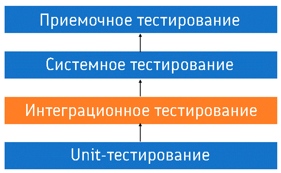
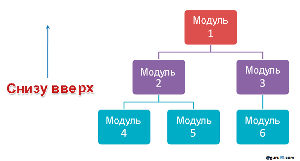
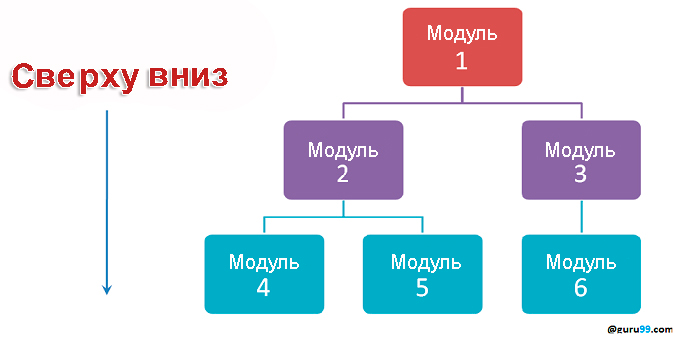
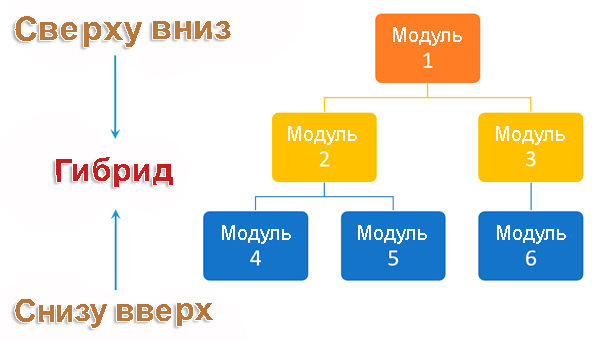

# Тестирование приложений. Интеграционное тестирование

Интеграционное тестирование – это тип тестирования, при котором программные модули логически интегрируются и тестируются как группа. Типичный программный проект состоит из нескольких программных модулей, написанных разными программистами. Цель интеграционного тестирования – выявить дефекты во взаимодействии между этими программными модулями, когда они интегрированы.



То, что каждый программный модуль проходит модульное тестирование, еще не значит, что при их интеграции не проявятся дефекты. Причины могут быть разными:

+ Модуль чаще всего создается одним разработчиком, чье понимание и логика программирования могут отличаться от понимания и логики других разработчиков. Для проверки того, что программные модули работают вместе, необходимо интеграционное тестирование.
+ Во время разработки модуля существует большая вероятность изменения требований со стороны клиентов. Не факт, что эти новые требования протестированы на уровне модулей, поэтому важно все проверить в ходе интеграционного тестирования системы.
+ Интерфейсы программных модулей со внешними аппаратными интерфейсами, если таковые имеются, могут содержать ошибки.
+ Неадекватная обработка исключений может привести к проблемам.

Интеграционный тест-кейс отличается от других тест-кейсов тем, что в нем основное внимание уделяется интерфейсам и потоку данных между модулями. Здесь приоритет отдается интегрирующим связям, а не функциям модулей, которые уже протестированы.

## Виды интеграционного тестирования

Существуют разные стратегии выполнения интеграционного тестирования:


+ Подход “Большого взрыва”
+ Инкрементальный подход:
  + сверху вниз
  + снизу вверх
  + “сэндвич” – комбинация двух предыдущих.

### Интеграционное тестирование методом “Большого взрыва”

Если вы применяете подход “Большого взрыва”, все компоненты или модули интегрируются вместе, а затем тестируются. При этом объединенный набор компонентов рассматривается как единое целое. Если не все компоненты в наборе завершены, интегрировать их не получится.

Преимущества: удобно для небольших систем.

Недостатки:

+ Локализация неисправностей затруднена.
+ Можно легко пропустить какие-то интерфейсы в силу того, что при таком подходе они тестируются в больших количествах.
+ Поскольку интеграционное тестирование можно начать только после окончания разработки всех модулей, у команды тестировщиков будет меньше времени на выполнение фазы тестирования.
+ Поскольку все модули тестируются сразу, критические модули с высоким риском не изолируются и не тестируются в приоритетном порядке. Периферийные модули, касающиеся пользовательских интерфейсов, также не изолируются и не тестируются в приоритетном порядке.

### Инкрементное интеграционное тестирование

Инкрементное тестирование проводится путем интеграции двух или более модулей, логически связанных друг с другом, после чего проверяется правильность функционирования приложения. Затем происходит постепенная интеграция других связанных модулей, и процесс продолжается до тех пор, пока все логически связанные модули не будут интегрированы и успешно протестированы.

Инкрементное тестирование может выполняться как снизу вверх, так и сверху вниз.

### Заглушки и драйверы

Заглушки и драйверы в интеграционном тестировании это программы, используемые для облегчения процесса тестирования. Они служат заменой отсутствующих моделей. Заглушки и драйверы не реализуют всю программную логику модуля, но имитируют обмен данными с вызывающим модулем во время тестирования.

+ Заглушка вызывается тестируемым модулем
+ Драйвер вызывает тестируемый модуль.

### Интеграционное тестирование снизу вверх

Интеграционное тестирование снизу вверх – это стратегия, при которой сначала тестируются модули нижнего уровня. Эти протестированные модули затем используются для облегчения тестирования модулей более высокого уровня. Процесс продолжается до тех пор, пока не будут протестированы все модули верхнего уровня. 



Преимущества:

+ Проще локализовать неисправности.
+ Не тратится время на ожидание разработки всех модулей, в отличие от подхода “Большого взрыва”.

Недостатки:

+ Критические модули (на верхнем уровне архитектуры программного обеспечения), которые управляют потоком приложения, тестируются в последнюю очередь и могут быть подвержены дефектам.
+ Ранний прототип невозможен.

### Интеграционное тестирование сверху вниз

Интеграционное тестирование сверху вниз – это метод, при котором интеграционное тестирование следует потоку управления системы. Чтобы проверить функциональность программного обеспечения, сначала тестируются модули верхнего уровня, а затем тестируются и интегрируются модули нижнего. Если какие-то модули не готовы, для тестирования используются заглушки.



Преимущества:

+ Упрощается локализация неисправностей.
+ Есть возможность получения раннего прототипа.
+ Критические модули тестируются в приоритетном порядке, поэтому основные недостатки конструкции можно найти и устранить в первую очередь.

Недостатки:

+ Требуется много заглушек.
+ Модули более низкого уровня тестируются неадекватно.

### Сэндвич-тестирование

Сэндвич-тестирование – это стратегия, при которой модули верхнего уровня тестируются вместе с модулями нижнего уровня, в то же время модули нижнего уровня интегрируются с модулями верхнего уровня и тестируются как система. Это сочетание нисходящего и восходящего подходов, поэтому его называют гибридным интеграционным тестированием. В нем используются как заглушки, так и драйверы.



### Как проводить интеграционное тестирование?

#### Процедура интеграционного тестирования не зависит от выбранной стратегии (“Большой взрыв”, “сверху вниз”, “снизу вверх”, “сэндвич”).

1. Составление плана интеграционных тестов
2. Разработка тестовых сценариев, кейсов и скриптов.
3. Выполнение тест-кейсов с последующим сообщением о дефектах.
4. Отслеживание и повторное тестирование дефектов.
5. Шаги 3 и 4 повторяются до успешного завершения интеграции.

#### План интеграционного тестирования

В плане тестирования должны быть отражены следующие аспекты:

+ методы/подходы к тестированию
+ область тестирования и элементы вне этой области
+ роли и обязанности
+ предварительные условия для интеграционного тестирования.
+ среда тестирования.
+ риски и планы по их снижению.

#### Вход и выход из интеграционного тестирования

Критерии входа:

+ Компоненты/модули прошли модульное тестирование
+ Все высокоприоритетные ошибки исправлены и закрыты
+ Все модули завершены и успешно интегрированы.
+ План тестирования, тест-кейс, сценарии подписаны и задокументированы
+ Необходимая тестовая среда настроена для интеграционного тестирования

Критерии выхода:

+ Успешное тестирование интегрированного приложения
+ Выполненные тест-кейсы задокументированы
+ Все баги с высоким приоритетом исправлены и закрыты
+ Техническая документация представлена с примечаниями к релизу.

#### Best Practices интеграционного тестирования

+ Сначала определите стратегию интеграционного тестирования. После ее утверждения подготовьте тест-кейсы и соответствующие тестовые данные.
+ Изучите архитектурный дизайн приложения и определите критические модули. Они должны быть протестированы в приоритетном порядке.
+ Получите проекты интерфейсов от команды архитекторов и создайте тест-кейсы для детальной проверки всех интерфейсов. Интерфейс с базой данных/внешним аппаратным/программным приложением должен быть детально протестирован.
+ После тест-кейсов решающую роль играют тестовые данные.
+ Всегда готовьте тестовые данные заранее, не во время выполнения тест-кейсов.

## Интеграционное тестирование в Spring

### Конфигурация среды для интеграционного тестирования

 Для проведения тестирования необходимо создать изолированную и управляемую среду для выполнения интеграционных тестов компонентов Spring-приложения: репозиториев (DAO), сервисов, транзакций и доступа к БД.

+ Тесты не должны зависеть от конфигурации “боевого” окружения.
+ Для скорости и предсказуемости тестов лучше использовать in-memory базу, например H2.
+ Разные типы тестов могут требовать разные настройки (например, логгирование, свойства Hibernate, база данных).
+ Интеграционные тесты  загружают Spring ApplicationContext

Основой для создания изолированной среды служит разделение конфигураций: AppConfig и TestConfig

+ Основная конфигурация приложения (AppConfig) используется в main — для запуска веб-приложения.
+ Отдельная конфигурация TestConfig создается в test и содержит настройки для базы данных H2, схемы, данных и параметров Hibernate.

Такой подход помогает изолировать среду тестирования и избежать ненужных зависимостей от внешней среды.

```kotlin
dependencies {
    implementation("org.springframework:spring-context:5.3.30")
    implementation("org.springframework:spring-orm:5.3.30")
    implementation("org.springframework:spring-tx:5.3.30")
    implementation("org.hibernate:hibernate-core:5.6.15.Final")
    implementation("jakarta.persistence:jakarta.persistence-api:2.2.3")
    implementation("com.h2database:h2:2.2.224")

    testImplementation("org.springframework:spring-test:6.2.2")
    testImplementation("org.junit.jupiter:junit-jupiter:5.10.2")
}
```

Конфигурация для тестирования

```java
@ExtendWith(SpringExtension.class)
@ContextConfiguration(classes = TestConfig.class)
@Transactional
@TestInstance(TestInstance.Lifecycle.PER_CLASS)

@Configuration
@ComponentScans({
    @ComponentScan(basePackages = "ru.bsuedu.cad.demo.entity"), 
    @ComponentScan(basePackages = "ru.bsuedu.cad.demo.repository"),
    @ComponentScan(basePackages = "ru.bsuedu.cad.demo.service")
})
@EnableJpaRepositories(basePackages = "ru.bsuedu.cad.demo.repository")
@EnableTransactionManagement
public class TestConfigDB {
    private static Logger LOGGER = LoggerFactory.getLogger(TestConfigDB.class);

    @Bean
    public DataSource dataSource() {
        return new EmbeddedDatabaseBuilder()
                    .setType(EmbeddedDatabaseType.H2)
                    .build();
    }

    @Bean
    public LocalContainerEntityManagerFactoryBean entityManagerFactory() {
        LocalContainerEntityManagerFactoryBean em = new LocalContainerEntityManagerFactoryBean();
        em.setDataSource(dataSource());

        em.setPackagesToScan("ru.bsuedu.cad.demo.entity");

        HibernateJpaVendorAdapter vendorAdapter = new HibernateJpaVendorAdapter();
        vendorAdapter.setShowSql(true);
        vendorAdapter.setGenerateDdl(true);
        vendorAdapter.setDatabasePlatform("org.hibernate.dialect.H2Dialect");
        em.setJpaVendorAdapter(vendorAdapter);

        // Дополнительные свойства JPA/Hibernate
        Properties properties = new Properties();
        properties.put(Environment.HBM2DDL_AUTO, "create-drop");
        properties.put(Environment.DIALECT, "org.hibernate.dialect.H2Dialect");
        properties.put(Environment.FORMAT_SQL, true);
        properties.put(Environment.USE_SQL_COMMENTS, false);
        properties.put(Environment.SHOW_SQL, true);
        properties.put(Environment.MAX_FETCH_DEPTH, 3);
        properties.put(Environment.STATEMENT_BATCH_SIZE, 10);
        properties.put(Environment.STATEMENT_FETCH_SIZE, 50);
        em.setJpaProperties(properties);

        return em;
    }
    @Bean
    public PlatformTransactionManager transactionManager(
            @Autowired EntityManagerFactory entityManagerFactory) {
        JpaTransactionManager transactionManager = new JpaTransactionManager();
        transactionManager.setEntityManagerFactory(entityManagerFactory);
        return transactionManager;
    }
}
```

### Использование аннотаций в тестах

Каждый тест должен быть оформлен с использованием следующих аннотаций:


```java
@ExtendWith(SpringExtension.class)
@ContextConfiguration(classes = TestConfigDB.class)
@Transactional
@Rollback
class StudentServiceIntegrationTest {

    @Autowired
    private StudentService studentService;

    @Autowired
    private GroupRepository groupRepository;

    @Autowired
    private StudentRepository studentRepository;

    @BeforeEach
    void setup() {
        Group group = new Group();
        group.setNumber(101);
        group.setDescription("101");
        groupRepository.save(group);
    }

    @Test
    void testCreateStudentAndFindById() {
        studentService.createStudent("Alex", 101);

        List<Student> students = studentRepository.findAll();
        assertEquals(1, students.size());

        Student student = students.get(0);
        assertEquals("Alex", student.getName());
        assertEquals(101, student.getGroup().getNumber());

        Student found = studentService.findById(student.getId());
        assertEquals(student.getId(), found.getId());
    }

    @Test
    void testFindAllStudents() {
        studentService.createStudent("Anna", 101);
        studentService.createStudent("Dmitry", 101);

        List<Student> students = studentService.findAllStudents();
        assertEquals(2, students.size());
    }
}
```

+ @ExtendWith(SpringExtension.class) — подключает поддержку Spring в JUnit 5.
+ @ContextConfiguration(classes = TestConfig.class) — указывает, какую конфигурацию Spring должен использовать при запуске теста.
+ @Transactional — каждый тест запускается в отдельной транзакции, которая откатывается автоматически после завершения, чтобы обеспечить чистое состояние БД.
+ @TestInstance(PER_CLASS) — позволяет использовать нестатические методы @BeforeAll, удобно для настройки данных.


### Инициализация данных через SQL

1. SQL-скрипты
Файлы schema.sql и data.sql кладутся в resources (обычно в src/test/resources):

``` java
@Sql(scripts = {"/schema.sql", "/data.sql"})
```

Spring автоматически выполнит эти скрипты перед каждым тестом (если указано).

2. Ручная инициализация

В методах @BeforeEach или @BeforeAll вручную создаются и сохраняются сущности через DAO или EntityManager.
